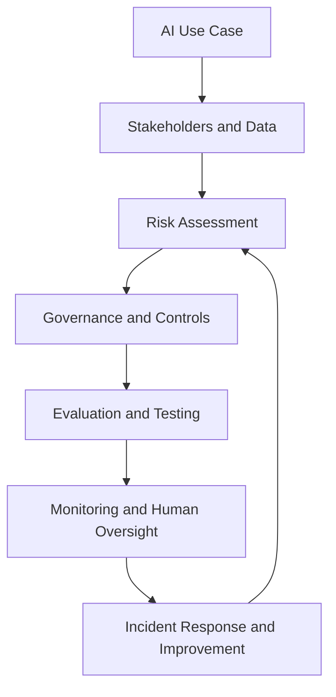

# AI Governance & Risk Assessment

## Designing Human Oversight for AI-Assisted Operations

> A fictional GRC portfolio case study demonstrating how an organization can govern an AI-assisted operational decision-support system from initial use-case intake through risk assessment, control design, evaluation, monitoring, human oversight, and incident response.


---

## Project Overview

Artificial intelligence can improve operational speed and consistency, but an AI recommendation can still be inaccurate, unsafe, unfair, insecure, or poorly understood. An organization therefore needs more than a model and a risk register. It needs clear accountability, defined decision rights, measurable evaluation criteria, meaningful human oversight, ongoing monitoring, documented evidence, and a process for responding when the system fails.

This project builds a practical **AI Governance and Risk Program** for a fictional logistics organization. It applies the **NIST AI Risk Management Framework (AI RMF)** to an AI-assisted routing and operational decision-support system called **PLG RouteAssist**.

The project follows this governance lifecycle:



The completed case study shows how governance decisions connect across the full AI lifecycle instead of treating policies, controls, testing, and monitoring as separate exercises.

---

## Business Scenario

**Peachtree Logistics Group (PLG)** is a fictional regional logistics company headquartered in Atlanta, Georgia. PLG has approximately 225 employees and works with independent couriers throughout the southeastern United States.

Its services include:

- Warehousing
- Last-mile delivery
- Medical courier services
- Freight brokerage

PLG is evaluating **RouteAssist**, an AI-assisted operational decision-support system designed to recommend:

- Delivery priorities
- Driver and courier assignments
- Delivery routes
- Operational exception classifications
- Potential schedule adjustments

RouteAssist uses information such as order details, delivery windows, location data, traffic conditions, driver availability, and operational incident records.

The system may improve dispatch efficiency, but its recommendations can affect delivery performance, customer commitments, workload distribution, medical-delivery timing, and the people who rely on PLG's services. These effects make governance, validation, documentation, and human accountability essential.

---

## Governance Boundary

RouteAssist is a **decision-support system**, not an autonomous decision-maker.

Authorized PLG personnel remain accountable for consequential operational decisions. RouteAssist may generate recommendations, but it may not independently:

- Make hiring, termination, disciplinary, or compensation decisions
- Deny a customer or recipient access to services
- Change the priority of a time-sensitive medical delivery without human review
- Approve a new use case or material system change
- Accept organizational risk
- Resume operation after a severe AI incident

These restrictions establish a clear line between machine-generated recommendations and human decision authority.

---

## Business Problem

PLG wants to benefit from AI-assisted dispatch and routing without introducing unmanaged operational, privacy, security, fairness, safety, compliance, or reputational risks.

The central governance question is:

> How can PLG use AI-generated operational recommendations while preserving human accountability, testing system performance, protecting affected parties, and responding effectively when the system behaves unexpectedly?

---

## Project Objectives

This project is designed to:

1. Document the AI system's intended purpose, boundaries, users, affected parties, data, and dependencies.
2. Establish stakeholder responsibilities, decision rights, and risk ownership.
3. Identify and assess risks across people, process, technology, data, vendors, and operations.
4. Map governance activities to the NIST AI RMF.
5. Design controls that reduce identified risks to acceptable levels.
6. Define meaningful human-review, override, escalation, and recordkeeping requirements.
7. Create a measurable AI evaluation methodology with acceptance thresholds.
8. Establish performance, drift, risk, and control-monitoring requirements.
9. Develop an AI-specific incident-response process.
10. Demonstrate control operation through realistic sample evidence.
11. Translate detailed findings into an executive remediation roadmap.

---

## Framework Approach

The primary framework for this project is the **NIST AI Risk Management Framework**, organized around its four core functions:

| NIST AI RMF Function | Application in This Project |
| --- | --- |
| **GOVERN** | Establish policies, accountability, decision authority, risk ownership, documentation, oversight, and lifecycle requirements. |
| **MAP** | Define the use context, system boundaries, stakeholders, affected parties, data, impacts, dependencies, and risk assumptions. |
| **MEASURE** | Evaluate performance, reliability, harmful outcomes, relevant impact differences, control effectiveness, and uncertainty. |
| **MANAGE** | Prioritize risks, implement treatments, monitor the system, respond to incidents, manage residual risk, and improve controls. |

Supporting references may be used where they add practical value, but framework mappings are not presented as certification, legal compliance, or independent assurance.

---

## Scope

### In Scope

- RouteAssist business use case and approval process
- AI system inventory and impact classification
- Stakeholders, affected parties, and accountability
- Data sources, flows, outputs, integrations, and trust boundaries
- AI, operational, privacy, security, fairness, safety, vendor, and reputational risks
- AI governance policies, standards, controls, and exceptions
- Human review, override, escalation, and documentation
- Predeployment evaluation and acceptance criteria
- Postdeployment performance, drift, and risk monitoring
- AI incident identification, response, recovery, and lessons learned
- Third-party AI and vendor due diligence
- Evidence collection and control testing
- Gap assessment and remediation planning
- Executive reporting

### Out of Scope

- Building or training a production AI model
- Production deployment or integration
- Penetration testing or adversarial exploitation of a live system
- Legal opinions or formal regulatory determinations
- Independent audit, certification, or assurance
- Real employee, driver, courier, customer, patient, or delivery data
- Claims that RouteAssist is safe, compliant, unbiased, or fit for production use

---

## Key Risk Domains

The assessment examines risks across the following domains:

| Risk Domain | Illustrative Concern |
| --- | --- |
| Governance | No accountable owner, unclear approvals, or undocumented risk acceptance |
| Data | Inaccurate, incomplete, outdated, improperly sourced, or overly sensitive input data |
| Performance | Recommendations fail under certain routes, delivery types, locations, or operating conditions |
| Fairness and harmful impact | Workload, opportunity, delay, or service impacts are distributed inequitably |
| Human factors | Reviewers over-rely on recommendations, lack context, or cannot meaningfully override the system |
| Privacy | Personal, location, customer, workforce, or medical-delivery information is misused or overexposed |
| Security | Unauthorized access, manipulated inputs, insecure integrations, or compromised system outputs |
| Safety and operations | Incorrect recommendations delay critical deliveries or disrupt time-sensitive operations |
| Third-party risk | Vendor limitations, weak transparency, subcontractor exposure, or inadequate incident notification |
| Change management | Model, data, configuration, integration, or use-case changes bypass revalidation |
| Monitoring | Performance degradation or emerging harm is not detected or escalated promptly |
| Incident response | PLG cannot contain failures, notify stakeholders, preserve evidence, or prevent recurrence |

---

## Repository Structure

```text
ai-governance-risk-assessment/
├── README.md
├── docs/          # 18 core assessment and governance documents
├── policies/      # 3 responsible AI policies and operating standards
├── templates/     # 7 reusable governance and evidence templates
├── evidence/      # 4 fictional sample control records
├── diagrams/      # 4 system and governance diagrams
└── presentation/  # Executive briefing and panel-defense outline
```

---

## Completed Deliverables

### Project Context and Risk Analysis

| Deliverable | Purpose | Status |
| --- | --- | --- |
| [Project Overview and Methodology](docs/00-project-overview-and-methodology.md) | Define objectives, scope, assumptions, constraints, methods, and success criteria. | ✅ Complete |
| [Organization Profile and AI Use Case](docs/01-organization-profile-and-ai-use-case.md) | Document the business context, intended use, expected benefits, limitations, and prohibited uses. | ✅ Complete |
| [Stakeholder and Accountability Map](docs/02-stakeholder-and-accountability-map.md) | Assign roles, decision rights, ownership, and RACI responsibilities. | ✅ Complete |
| [AI System Inventory and Impact Screening](docs/03-ai-system-inventory-and-impact-screening.md) | Record the system and determine its initial impact and review requirements. | ✅ Complete |
| [Data Flow and System Context](docs/04-data-flow-and-system-context.md) | Define components, integrations, data categories, boundaries, inputs, and outputs. | ✅ Complete |
| [AI Risk Assessment Methodology](docs/05-ai-risk-assessment-methodology.md) | Establish the taxonomy, scoring model, treatment criteria, and review process. | ✅ Complete |
| [AI Risk Register](docs/06-ai-risk-register.md) | Document risk statements, scores, owners, controls, treatments, and target dates. | ✅ Complete |
| [Framework Crosswalk](docs/07-framework-crosswalk.md) | Map project activities and evidence to NIST AI RMF functions. | ✅ Complete |

### Governance and Control Design

| Deliverable | Purpose | Status |
| --- | --- | --- |
| [AI Governance Charter](docs/08-ai-governance-charter.md) | Define governance authority, forums, approvals, exceptions, and reporting. | ✅ Complete |
| [AI Control Matrix](docs/09-ai-control-matrix.md) | Connect risks to control activities, owners, frequencies, evidence, and tests. | ✅ Complete |
| [Human Oversight and Escalation Plan](docs/10-human-oversight-and-escalation-plan.md) | Define review points, reviewer authority, overrides, escalation, and recordkeeping. | ✅ Complete |
| [Responsible AI Policy](policies/responsible-ai-policy.md) | Establish organization-wide AI governance principles and requirements. | ✅ Complete |
| [AI Acceptable Use Standard](policies/ai-acceptable-use-standard.md) | Define permitted, restricted, and prohibited AI use. | ✅ Complete |
| [AI Change and Revalidation Standard](policies/ai-system-change-and-revalidation-standard.md) | Identify changes requiring review, testing, approval, or rollback. | ✅ Complete |

### Evaluation, Monitoring, and Response

| Deliverable | Purpose | Status |
| --- | --- | --- |
| [AI Evaluation and Testing Plan](docs/11-ai-evaluation-and-testing-plan.md) | Define test scenarios, datasets, metrics, thresholds, and acceptance decisions. | ✅ Complete |
| [Monitoring, Metrics, and Reporting Plan](docs/12-monitoring-metrics-and-reporting-plan.md) | Establish KPIs, KRIs, drift signals, thresholds, owners, and reporting cadence. | ✅ Complete |
| [AI Incident Response Plan](docs/13-ai-incident-response-plan.md) | Define severity, triage, containment, investigation, recovery, and improvement. | ✅ Complete |
| [Third-Party and Vendor AI Risk Review](docs/14-third-party-and-vendor-ai-risk-review.md) | Assess vendor governance, data use, security, transparency, monitoring, and exit risk. | ✅ Complete |
| [Gap Assessment and POA&M](docs/15-gap-assessment-and-poam.md) | Prioritize control gaps and assign remediation actions, owners, and deadlines. | ✅ Complete |

### Reporting and Reflection

| Deliverable | Purpose | Status |
| --- | --- | --- |
| [Executive Summary and Recommendations](docs/16-executive-summary-and-recommendations.md) | Present the risk posture, key findings, decisions, and prioritized roadmap. | ✅ Complete |
| [Lessons Learned and Portfolio Reflection](docs/17-lessons-learned-and-portfolio-reflection.md) | Explain tradeoffs, limitations, learning outcomes, and future improvements. | ✅ Complete |
| [Executive Briefing Outline](presentation/executive-briefing-outline.md) | Convert the case study into a leadership presentation and interview narrative. | ✅ Complete |

### Reusable Templates

| Deliverable | Purpose | Status |
| --- | --- | --- |
| [AI Use-Case Intake Template](templates/ai-use-case-intake-template.md) | Capture purpose, users, data, decisions, benefits, limitations, and initial approvals. | ✅ Complete |
| [AI Impact Assessment Template](templates/ai-impact-assessment-template.md) | Evaluate potential effects on people, operations, rights, safety, and compliance. | ✅ Complete |
| [AI Evaluation Record Template](templates/ai-evaluation-record-template.md) | Record evaluation scope, methods, results, thresholds, defects, and decisions. | ✅ Complete |
| [Human-Review Decision Log Template](templates/human-review-decision-log-template.md) | Document recommendations, reviewer decisions, overrides, reasons, and escalations. | ✅ Complete |
| [AI Incident Record Template](templates/ai-incident-record-template.md) | Record incident detection, severity, response, evidence, recovery, and lessons learned. | ✅ Complete |
| [AI Model Card Template](templates/ai-model-card-template.md) | Summarize model purpose, data, performance, limitations, risks, and governance. | ✅ Complete |
| [Vendor AI Risk Questionnaire](templates/vendor-ai-risk-questionnaire-template.md) | Assess vendor governance, security, privacy, transparency, resilience, and exit risk. | ✅ Complete |

### Sample Evidence

| Deliverable | Purpose | Status |
| --- | --- | --- |
| [Sample Governance Committee Minutes](evidence/01-sample-governance-committee-minutes.md) | Demonstrate documented oversight, decisions, and action ownership. | ✅ Complete |
| [Sample Human-Review Decision Record](evidence/02-sample-human-review-decision-record.md) | Demonstrate human challenge, modification, rationale, and escalation. | ✅ Complete |
| [Sample Evaluation and Monitoring Report](evidence/03-sample-evaluation-and-monitoring-report.md) | Demonstrate threshold testing, findings, and deployment recommendations. | ✅ Complete |
| [Sample AI Incident Tabletop Record](evidence/04-sample-ai-incident-tabletop-record.md) | Demonstrate incident, fallback, vendor-escalation, and recovery exercises. | ✅ Complete |

### Diagrams

| Deliverable | Purpose | Status |
| --- | --- | --- |
| [AI System Context Diagram](diagrams/01-ai-system-context-diagram.md) | Show actors, systems, external services, and trust boundaries. | ✅ Complete |
| [AI Data-Flow Diagram](diagrams/02-ai-data-flow-diagram.md) | Trace data from collection through recommendation, decision, and monitoring. | ✅ Complete |
| [AI Governance Accountability Diagram](diagrams/03-ai-governance-accountability-diagram.md) | Show governance, ownership, assurance, and escalation relationships. | ✅ Complete |
| [Human Oversight and Escalation Flow](diagrams/04-human-oversight-and-escalation-flow.md) | Show review decisions, fallback, escalation, evidence, and monitoring. | ✅ Complete |

---

## Traceability Model

The project uses consistent identifiers to connect decisions across artifacts.

| Record Type | Identifier Example |
| --- | --- |
| AI system | `AI-SYS-001` |
| Role | `ROLE-004` |
| Data category | `DATA-006` |
| AI risk | `AIR-007` |
| AI control | `AIC-012` |
| Evaluation | `EVAL-003` |
| Metric or indicator | `MET-009` |
| Evidence item | `EVD-014` |
| Gap | `GAP-005` |
| Remediation action | `POAM-005` |
| AI incident | `AI-INC-2026-001` |

High and critical risks follow this traceability chain:

```text
Use case or process
    → affected stakeholder or asset
    → AI risk
    → control objective and activity
    → evaluation or control test
    → evidence
    → monitoring threshold
    → escalation or remediation
```

---

## AI Evaluation Strategy

The evaluation program tests more than aggregate accuracy. It examines whether RouteAssist performs reliably under the conditions in which PLG expects to use it.

Evaluation areas include:

- Recommendation accuracy and operational usefulness
- Performance across delivery types, locations, time windows, and operating conditions
- False-positive and false-negative consequences
- Reliability when data is incomplete, delayed, unusual, or out of distribution
- Impact differences affecting employees, couriers, customers, recipients, or service categories
- Human ability to understand, challenge, reject, and override recommendations
- Security and misuse scenarios
- Regression after model, data, vendor, configuration, integration, or use-case changes
- Evidence that predefined acceptance thresholds were met before approval

Final metrics and thresholds are documented in the evaluation plan rather than assumed in advance.

---

## Human Oversight Principles

Human oversight is designed as an operating control—not a checkbox. The completed program specifies:

- Which recommendations require human review
- Who is qualified and authorized to review them
- What information reviewers must receive
- When a recommendation must be rejected or escalated
- Who may override the system
- How overrides and rationales are recorded
- How quickly escalations must be addressed
- When system use must be limited or suspended
- Who may authorize a return to service
- How reviewer behavior and over-reliance are monitored

---

## Skills Demonstrated

This project demonstrates practical capability in:

- AI governance program design
- NIST AI RMF application
- AI use-case intake and system inventory
- AI impact and risk assessment
- Risk scoring and treatment planning
- Stakeholder analysis and RACI development
- Data-flow and system-context analysis
- Policy and standard development
- Control design and framework mapping
- Human oversight and escalation design
- AI evaluation and acceptance criteria
- Performance, drift, and risk monitoring
- AI incident response
- Third-party AI risk management
- Evidence collection and control testing
- Gap assessment and POA&M management
- Executive reporting and risk communication

---

## Project Status

**Project 2 is complete.** The repository contains the full fictional AI governance case study, including the assessment methodology, risk register, framework crosswalk, governance documents, control design, evaluation and monitoring plans, reusable templates, sample evidence, diagrams, remediation plan, and executive reporting materials.

### Completion Checklist

- [x] Define the portfolio concept
- [x] Establish the fictional organization and primary AI use case
- [x] Complete the project overview and methodology
- [x] Document the organization, AI system, scope, and impact classification
- [x] Map stakeholders, accountability, data, and system context
- [x] Assess and prioritize AI risks
- [x] Design governance, policies, standards, and controls
- [x] Define human oversight, escalation, and fallback requirements
- [x] Develop evaluation, acceptance, and monitoring plans
- [x] Create AI incident-response and vendor-risk processes
- [x] Complete the gap assessment and POA&M
- [x] Build reusable templates and fictional sample evidence
- [x] Create system, data-flow, accountability, and escalation diagrams
- [x] Produce the executive summary, briefing outline, and portfolio reflection

### Repository Totals

| Section | Markdown Files |
| --- | ---: |
| Core documentation | 18 |
| Policies and standards | 3 |
| Reusable templates | 7 |
| Sample evidence | 4 |
| Diagrams | 4 |
| Executive presentation | 1 |
| Repository README | 1 |
| **Total** | **38** |

---

## Important Notice

This repository is an educational portfolio project based on a fictional organization and fictional AI system. It does not contain real PLG, employee, courier, customer, patient, or delivery information.

The materials do not constitute legal advice, regulatory advice, independent assurance, certification, or a guarantee that an AI system is safe, fair, secure, compliant, or appropriate for production deployment.

---

## Author

**Tommy Marshall**  
GRC and cloud-security practitioner in development  
Founder, **NeoFyte — Cybersecurity Made Human**

This project reflects my focus on building governance that people can understand, follow, test, and improve.

> Think before you click.
