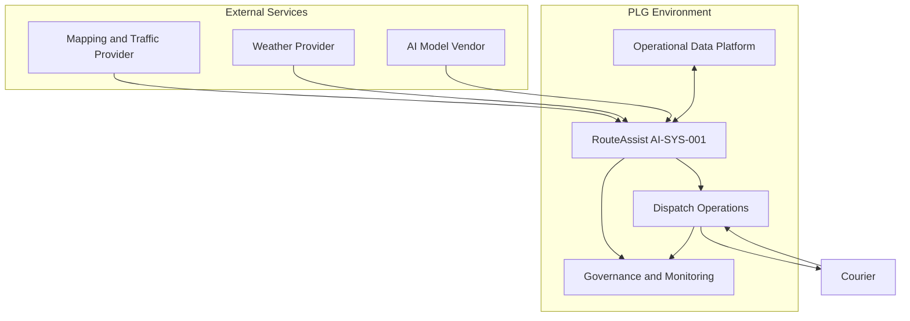

# AI System Context Diagram

## Purpose

This diagram shows the primary actors, systems, information exchanges, and trust boundaries surrounding PLG RouteAssist (`AI-SYS-001`). It is a logical view intended to support governance review, risk analysis, and control design.

## System Context

## Actors and Responsibilities

| Actor or Component | Role |
| --- | --- |
| Courier | Supplies field status and carries out approved dispatch instructions |
| Dispatch Operations | Reviews AI recommendations and makes the final routing decision |
| RouteAssist | Generates route recommendations and supporting rationale |
| Operational Data Platform | Supplies order, location, capacity, and historical operational data |
| External service providers | Supply mapping, traffic, weather, and model capabilities |
| Governance and Monitoring | Receives logs, metrics, exceptions, and review evidence |

## Trust Boundaries

1. External-provider data enters the PLG environment and must be authenticated, validated, and monitored.
2. RouteAssist recommendations cross into human operational decision-making and require meaningful review.
3. Operational and monitoring data may contain sensitive information and must be protected according to classification and retention requirements.

## Key Control References

- `AIC-003` — AI system inventory and ownership
- `AIC-009` — human review and approval
- `AIC-014` — third-party AI risk management
- `AIC-020` — logging and traceability
- `AIC-023` — input validation and data-quality checks
- `AIC-024` — fallback and manual operations

## Repository Path

`diagrams/01-ai-system-context-diagram.md`
