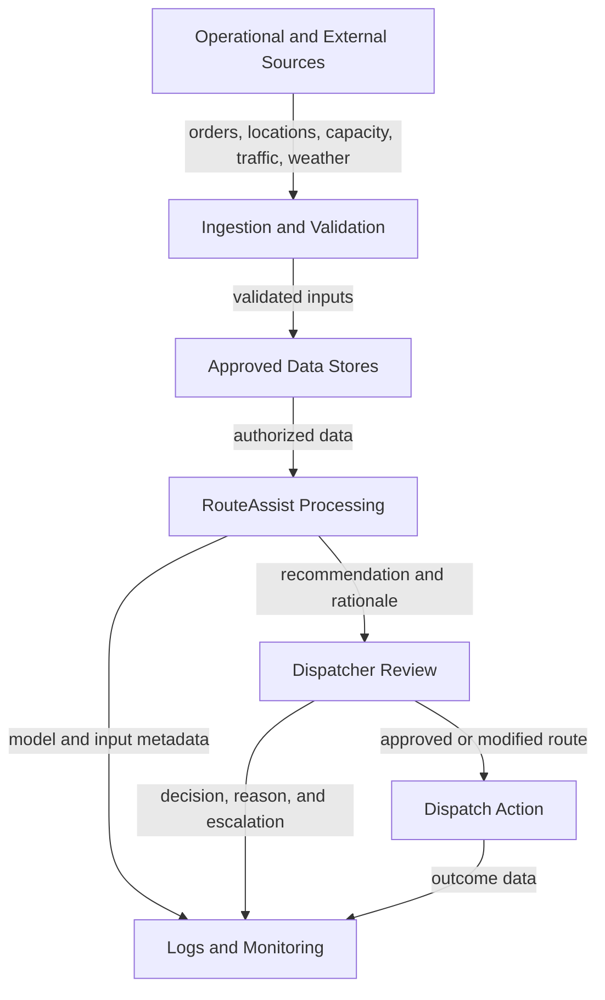

# AI Data Flow Diagram

## Purpose

This diagram traces how data moves through PLG RouteAssist (`AI-SYS-001`), from source collection through recommendation, human decision, operational action, and monitoring.

## Data Flow

## Data Inventory

| Data Category | Example Data | Source | Primary Use | Key Concern |
| --- | --- | --- | --- | --- |
| Order data | Pickup, destination, service priority | Order-management system | Route generation | Accuracy and access control |
| Location data | Courier and vehicle position | Mobile or fleet system | Route optimization | Privacy and retention |
| Capacity data | Vehicle availability and load | Dispatch systems | Feasibility checks | Completeness and timeliness |
| External conditions | Traffic, closures, weather | Third-party providers | Route safety and efficiency | Freshness and vendor reliability |
| AI output | Route, confidence, rationale | RouteAssist | Decision support | Explainability and unsafe output |
| Review record | Approval, modification, rejection, reason | Dispatcher | Human oversight evidence | Completeness and authenticity |
| Outcome data | Delivery status, delay, incident | Operations systems | Monitoring and improvement | Feedback-loop quality |

## Required Data Controls

1. Validate source identity, schema, completeness, range, and freshness before use.
2. Block or flag recommendations when critical inputs are missing or stale.
3. Limit collection and retention to approved operational purposes.
4. Encrypt sensitive data in transit and at rest.
5. Record model version, material inputs, output, reviewer action, and final outcome.
6. Separate production monitoring from model-development use unless reuse is approved.

## Risk References

- `AIR-002` — inaccurate or poor-quality input data
- `AIR-003` — stale external data
- `AIR-005` — ineffective human oversight
- `AIR-009` — sensitive-data exposure
- `AIR-014` — incomplete logging and traceability

## Repository Path

`diagrams/02-ai-data-flow-diagram.md`
