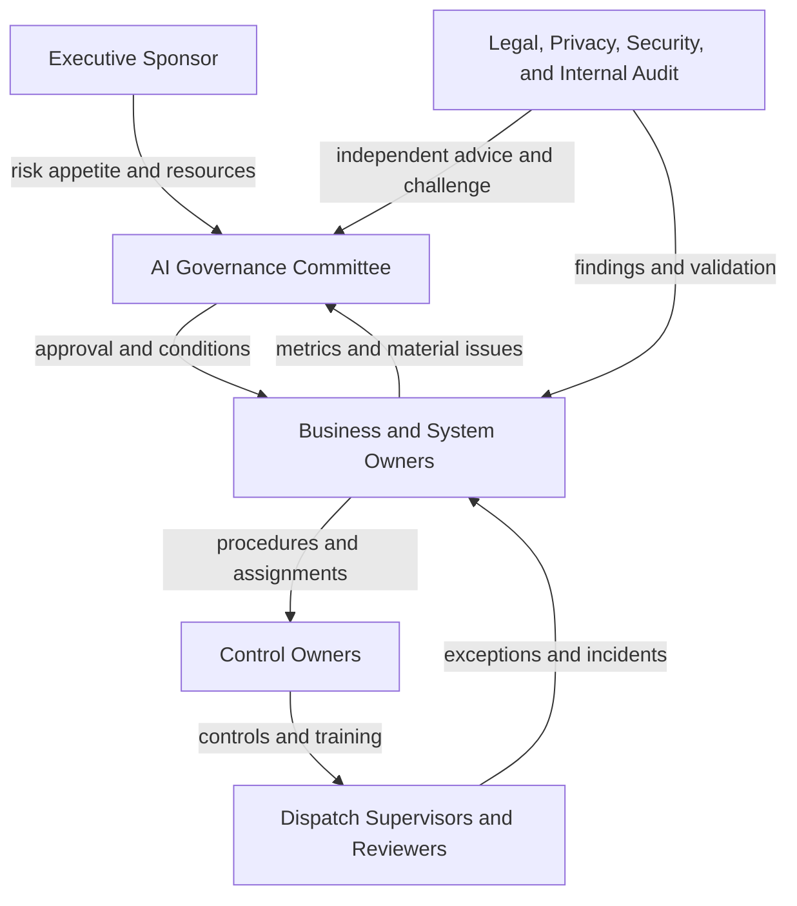

# AI Governance Accountability Diagram

## Purpose

This diagram presents the governance and accountability structure for PLG RouteAssist (`AI-SYS-001`). It clarifies oversight, operational ownership, assurance, and escalation relationships.

## Accountability Structure

## Decision Rights

| Governance Role | Primary Accountability | Key Decisions |
| --- | --- | --- |
| Executive Sponsor | Executive ownership and resources | Risk acceptance, funding, strategic direction |
| AI Governance Committee | Cross-functional oversight | Use-case approval, deployment conditions, suspension, residual-risk recommendation |
| Business Owner | Business outcome and acceptable use | Operating scope, process integration, user accountability |
| System Owner | Technical lifecycle and service operation | Release readiness, access, configuration, recovery |
| Model or Data Owner | Model and data performance | Evaluation, change review, data-quality remediation |
| Control Owner | Control design and operation | Procedures, evidence, issue correction |
| Dispatch Supervisor | Front-line oversight | Exception handling, escalation, fallback activation |
| Legal, Privacy, and Security | Specialist review and challenge | Compliance, privacy, contractual, and security requirements |
| Internal Audit or Independent Assurance | Objective assessment | Control-effectiveness and remediation validation |

## Escalation Principles

1. Safety, privacy, security, or material compliance concerns are escalated immediately.
2. Control owners report failed controls and overdue corrective actions to the system owner.
3. The system owner elevates material residual risk to the AI Governance Committee.
4. Only an authorized executive may accept risk beyond the committee's delegated authority.
5. Independent assurance retains freedom to report significant findings directly to executive oversight.

## Evidence Produced

- Governance meeting minutes and approval records
- Risk-acceptance and exception records
- Control-test results and remediation evidence
- Human-review and escalation records
- Monitoring reports and incident records

## Repository Path

`diagrams/03-ai-governance-accountability-diagram.md`
