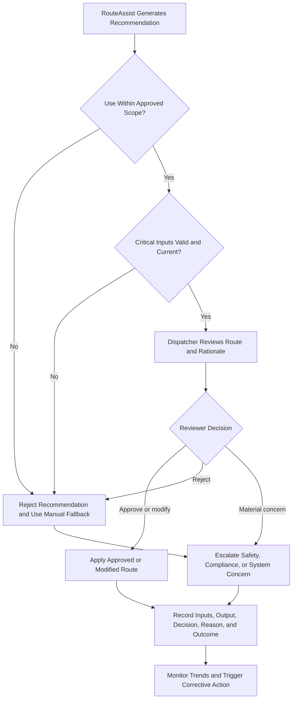

# Human Oversight and Escalation Flow

## Purpose

This flow defines how a dispatcher reviews a RouteAssist recommendation, exercises decision authority, records the outcome, and escalates unsafe or unreliable behavior.

## Review and Escalation Flow

## Required Review Checks

Before acting, the reviewer confirms that:

- the use is within the approved operational scope;
- medical or other prohibited routing is excluded;
- critical traffic, closure, weather, and capacity data are current;
- the route and rationale are coherent and operationally feasible;
- safety, privacy, and service constraints are satisfied; and
- the reviewer has enough time and authority to challenge the recommendation.

## Decision Outcomes

| Outcome | Required Action |
| --- | --- |
| Approve | Apply the recommendation and record the basis for approval |
| Modify | Apply the human-selected route and record the modification reason |
| Reject | Use an approved alternative or manual process and document why |
| Escalate | Notify the appropriate supervisor or control owner and preserve evidence |

## Immediate Escalation Triggers

- A recommendation could create a safety or legal violation.
- The system operates outside its approved purpose or population.
- Critical source data are unavailable, stale, or contradictory.
- The model version or configuration is unapproved.
- Required logs are missing or appear altered.
- Similar overrides or failures indicate a recurring pattern.

## Control References

- `AIC-009` — human review and approval
- `AIC-020` — logging and traceability
- `AIC-021` — incident reporting and response
- `AIC-023` — input validation and data-quality checks
- `AIC-024` — fallback and manual operations

## Repository Path

`diagrams/04-human-oversight-and-escalation-flow.md`
