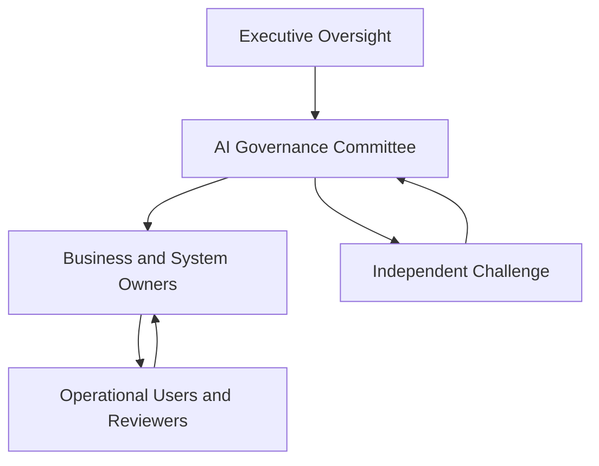

# Stakeholder and Accountability Map

## PLG RouteAssist AI Governance Program

**Organization:** Peachtree Logistics Group (fictional)  
**AI system:** PLG RouteAssist  
**System identifier:** `AI-SYS-001`  
**Use-case identifier:** `UC-001`  
**Document owner:** GRC Analyst  
**Document status:** Draft portfolio artifact  
**Version:** 1.0  
**Review frequency:** Annually and upon material organizational, system, or use-case change

---

## 1. Document Purpose

This document identifies the stakeholders and affected parties connected to PLG RouteAssist and assigns clear accountability across the AI lifecycle. It defines governance layers, stable role identifiers, decision rights, risk ownership, consultation requirements, escalation paths, and Responsible, Accountable, Consulted, and Informed (RACI) assignments.

The map is intended to prevent accountability gaps, conflicting authority, silent risk acceptance, ineffective human oversight, and the assumption that responsibility can be transferred to an AI system or vendor.

---

## 2. Accountability Principles

PLG will apply the following principles:

1. **People remain accountable.** RouteAssist cannot own a risk, approve a use case, accept residual risk, close an incident, or authorize its own return to service.
2. **One accountable role is named.** Each material activity or decision should have one clearly identified accountable role, even when several roles perform or advise on the work.
3. **Responsibility follows authority.** A person cannot be responsible for a control or decision without sufficient access, information, competence, time, and authority.
4. **Independence is preserved.** A person who develops, configures, or operates a control should not be the sole person who independently evaluates its effectiveness.
5. **Affected parties are considered.** People who do not use RouteAssist may still experience its benefits or harms and must be considered in governance decisions.
6. **High-impact decisions receive heightened oversight.** Medical-delivery prioritization, repeated workforce effects, severe incidents, and material system changes require stronger review.
7. **Disagreement is documented.** Material objections, overrides, minority views, exceptions, and unresolved concerns are recorded and escalated rather than suppressed.
8. **Delegation is explicit.** Temporary or alternate decision authority must be documented, time-limited, and appropriate to the decision.
9. **Vendor responsibility does not replace PLG accountability.** Contractual obligations support governance but do not transfer PLG's responsibility for its use of RouteAssist.
10. **Conflicts are escalated.** Operational urgency does not permit unauthorized risk acceptance or bypass of mandatory safeguards.

---

## 3. RACI Definitions

| Designation | Meaning | Application |
| --- | --- | --- |
| **R — Responsible** | Performs or coordinates the work. | One or more roles may be responsible. |
| **A — Accountable** | Owns the outcome and has final decision authority. | One role should be accountable for each activity. |
| **C — Consulted** | Provides required expertise or affected-party perspective before the decision. | Consultation is two-way and occurs before completion. |
| **I — Informed** | Receives the decision, result, status, or escalation. | Communication is one-way unless follow-up is requested. |

RACI assignments do not replace policy requirements, job descriptions, legal duties, contracts, or emergency authority.

---

## 4. Governance Structure

RouteAssist governance operates through four layers.

| Layer | Purpose | Primary roles |
| --- | --- | --- |
| Executive oversight | Set risk tolerance, approve resources, resolve major conflicts, and accept designated high residual risks. | Chief Operating Officer and executive leadership |
| Governance and challenge | Review use cases, impacts, risks, controls, evaluations, exceptions, incidents, and material changes. | AI Governance Committee, GRC, Legal/Privacy, Information Security, Internal Audit |
| System and business ownership | Own the business outcome, technical environment, data, vendor relationship, and day-to-day operating controls. | Dispatch Director, CIO/IT Director, Data/AI Lead, Procurement/Vendor Manager |
| Operational execution | Review recommendations, make authorized decisions, document overrides, report concerns, and follow escalation procedures. | Dispatch supervisors, dispatchers, operations managers, drivers, and couriers |

### 4.1 Governance model

The governance structure separates executive authority, governance review, operational ownership, and independent challenge while preserving an escalation path from frontline users to decision makers.

---

## 5. Internal Role Register

### `ROLE-001` — Chief Operating Officer

| Field | Description |
| --- | --- |
| Governance position | Executive sponsor |
| Primary accountability | Business sponsorship, resource approval, executive risk decisions, and alignment with PLG strategy |
| Key decisions | Approves designated high residual risks, resolves major business conflicts, and supports suspension or retirement decisions when required |
| Required information | Executive risk summary, evaluation results, unresolved gaps, incidents, costs, business benefits, and residual-risk statement |
| Independence concern | Should not override mandatory control or assurance requirements solely to accelerate deployment |
| Escalates to | Executive leadership or governing body when risk exceeds delegated authority |

### `ROLE-002` — AI Governance Committee

| Field | Description |
| --- | --- |
| Governance position | Cross-functional governance and approval body |
| Primary accountability | Lifecycle governance, use-case approval, impact and risk review, exceptions, material changes, severe incidents, and periodic review |
| Standing representation | Operations, IT, GRC, Information Security, Legal/Privacy, Data/AI, Procurement, and other specialists as required |
| Key decisions | Approves progression through governance gates, imposes conditions, restricts use, requires remediation, recommends suspension, and records risk decisions |
| Required information | Use-case record, impact screening, risk register, controls, evaluation results, monitoring trends, incidents, complaints, overrides, and assurance findings |
| Independence concern | Members must disclose conflicts and avoid approving work they cannot objectively challenge |
| Escalates to | Chief Operating Officer for decisions beyond committee authority |

### `ROLE-003` — GRC Analyst

| Field | Description |
| --- | --- |
| Governance position | Program and methodology lead |
| Primary accountability | Maintains the governance methodology, coordinates risk assessment, maps frameworks, tracks controls and evidence, and reports gaps |
| Key responsibilities | Facilitate assessments, maintain traceability, challenge unsupported claims, coordinate reviews, and manage the POA&M |
| Required information | System records, stakeholder input, data flows, vendor documentation, evaluation evidence, control evidence, incidents, and metrics |
| Independence concern | May design governance processes but should not be the sole evaluator of controls the GRC function operates |
| Escalates to | AI Governance Committee and executive sponsor |

### `ROLE-004` — Dispatch Director

| Field | Description |
| --- | --- |
| Governance position | Business owner and RouteAssist system owner |
| Primary accountability | Approved business purpose, operational outcomes, user authorization, process integration, and appropriate human decision-making |
| Key decisions | Proposes the use case, confirms operational requirements, approves routine operating procedures, and owns business remediation |
| Required information | Operational performance, reviewer feedback, overrides, complaints, incidents, workload impacts, and system limitations |
| Independence concern | Business-benefit targets must not discourage overrides, incident reporting, or objective risk review |
| Escalates to | Chief Operating Officer and AI Governance Committee |

### `ROLE-005` — CIO / IT Director

| Field | Description |
| --- | --- |
| Governance position | Technical owner |
| Primary accountability | Architecture, integrations, availability, access, logging, configuration, change management, continuity, and technical recovery |
| Key decisions | Approves technical implementation within authorized scope and coordinates technical suspension, rollback, or restoration |
| Required information | Architecture, data flows, access records, change records, system health, security events, and vendor technical notices |
| Independence concern | Technical completion does not constitute business, risk, privacy, or production approval |
| Escalates to | AI Governance Committee and Chief Operating Officer |

### `ROLE-006` — Data / AI Lead

| Field | Description |
| --- | --- |
| Governance position | Model, data, and evaluation subject-matter owner |
| Primary accountability | Technical documentation of system behavior, data suitability, evaluation design, performance analysis, limitations, drift, and revalidation |
| Key decisions | Recommends technical acceptance, remediation, retraining, recalibration, rollback, or further testing |
| Required information | Data lineage, datasets, model or vendor documentation, test results, performance slices, uncertainty, changes, and monitoring trends |
| Independence concern | Cannot be the sole approver of its own evaluation design, results, or production readiness recommendation |
| Escalates to | CIO/IT Director and AI Governance Committee |

### `ROLE-007` — Information Security Lead

| Field | Description |
| --- | --- |
| Governance position | Security risk and incident authority |
| Primary accountability | Security requirements, threat analysis, access controls, monitoring, vulnerability response, and security-incident coordination |
| Key decisions | Recommends or initiates emergency containment within delegated authority and approves security remediation evidence |
| Required information | Architecture, access model, logs, threats, vulnerabilities, vendor security information, and incident evidence |
| Independence concern | Security approval does not replace business, privacy, evaluation, or governance approval |
| Escalates to | CIO/IT Director, AI Governance Committee, and executive sponsor for severe matters |

### `ROLE-008` — Legal / Privacy Advisor

| Field | Description |
| --- | --- |
| Governance position | Legal, privacy, contractual, and rights advisor |
| Primary accountability | Advises on legal obligations, privacy risks, purpose limitation, notices, rights, complaints, contracts, retention, and disclosures |
| Key decisions | Provides required legal or privacy review and identifies issues requiring specialized counsel or leadership decision |
| Required information | Use case, data inventory, data flows, affected parties, contracts, notices, retention, complaints, and proposed secondary uses |
| Independence concern | Legal review should not be represented as technical validation or proof of system safety |
| Escalates to | AI Governance Committee, executive sponsor, or qualified outside counsel as appropriate |

### `ROLE-009` — Procurement / Vendor Manager

| Field | Description |
| --- | --- |
| Governance position | Third-party relationship owner |
| Primary accountability | Vendor due diligence, contract requirements, subcontractor visibility, service commitments, notifications, audit rights, and exit planning |
| Key decisions | Recommends vendor approval, conditional approval, remediation, renewal, restriction, or termination |
| Required information | Vendor questionnaire, security and privacy evidence, AI documentation, service levels, incident history, subcontractors, and termination provisions |
| Independence concern | Cost or schedule pressure must not substitute for required due diligence |
| Escalates to | AI Governance Committee, Legal/Privacy Advisor, and executive sponsor |

### `ROLE-010` — Dispatch Supervisor

| Field | Description |
| --- | --- |
| Governance position | Operational oversight and escalation lead |
| Primary accountability | Supervises human review, resolves escalations, monitors overrides, documents operational concerns, and enforces use boundaries |
| Key decisions | Approves defined high-impact or exceptional operational decisions and may direct personnel to stop relying on RouteAssist |
| Required information | Recommendation rationale, current conditions, delivery requirements, reviewer notes, uncertainty, incidents, and relevant alerts |
| Independence concern | Performance pressure must not discourage legitimate overrides or reporting |
| Escalates to | Dispatch Director, incident authority, or AI Governance Committee depending on severity |

### `ROLE-011` — Dispatcher

| Field | Description |
| --- | --- |
| Governance position | Primary user and human decision reviewer |
| Primary accountability | Reviews recommendations, applies authorized judgment, confirms relevant context, documents required decisions, and escalates concerns |
| Key decisions | Accepts, modifies, rejects, overrides, or escalates recommendations within assigned authority |
| Required information | Delivery requirements, relevant input data, recommendation, rationale, uncertainty, system limitations, and escalation criteria |
| Independence concern | Must have a realistic ability to disagree with RouteAssist without retaliation or unreasonable performance penalty |
| Escalates to | Dispatch Supervisor |

### `ROLE-012` — Operations Manager

| Field | Description |
| --- | --- |
| Governance position | Cross-process operational stakeholder |
| Primary accountability | Evaluates effects on service delivery, warehouses, staffing, customer commitments, continuity, and operational performance |
| Key decisions | Coordinates operational remediation and recommends changes to processes or pilot boundaries |
| Required information | Performance trends, delivery failures, warehouse effects, complaints, overrides, incidents, and continuity impacts |
| Independence concern | Efficiency goals must be balanced against safety, workforce, customer, and compliance concerns |
| Escalates to | Dispatch Director and Chief Operating Officer |

### `ROLE-013` — Human Resources Manager

| Field | Description |
| --- | --- |
| Governance position | Workforce-impact advisor |
| Primary accountability | Advises on workforce effects, training, role expectations, disputes, retaliation concerns, and employment-related boundaries |
| Key decisions | Reviews workforce-impact controls and coordinates employee-related remediation within HR authority |
| Required information | Assignment patterns, worker complaints, workload analysis, training results, and proposed secondary uses |
| Independence concern | RouteAssist data must not silently become an employment-decision tool |
| Escalates to | Legal/Privacy Advisor, AI Governance Committee, and executive leadership as appropriate |

### `ROLE-014` — Customer Service Manager

| Field | Description |
| --- | --- |
| Governance position | Customer-impact and complaint owner |
| Primary accountability | Maintains complaint intake, customer communication, issue routing, and feedback trends related to AI-assisted operations |
| Key decisions | Escalates material or repeated complaints and approves customer-facing responses within authority |
| Required information | Delivery records, recommendation history, human decisions, complaint details, incidents, and approved explanations |
| Independence concern | Customer communication must not overstate system certainty or conceal AI-related errors |
| Escalates to | Dispatch Director, Legal/Privacy Advisor, and incident authority |

### `ROLE-015` — Internal Audit / Assurance

| Field | Description |
| --- | --- |
| Governance position | Independent assurance function |
| Primary accountability | Independently evaluates selected governance and control design, evidence, and operating effectiveness |
| Key decisions | Issues findings, rates deficiencies under the assurance methodology, and recommends remediation or escalation |
| Required information | Policies, risks, controls, evaluations, evidence, access, logs, exceptions, incidents, and remediation records |
| Independence concern | Should not own or operate the controls it evaluates |
| Escalates to | Appropriate executive or governance authority while preserving assurance independence |

### `ROLE-016` — Business Continuity / Incident Manager

| Field | Description |
| --- | --- |
| Governance position | Cross-functional incident and recovery coordinator |
| Primary accountability | Coordinates severity assessment, containment, communications, continuity, recovery, evidence preservation, and lessons learned |
| Key decisions | Activates incident procedures and recommends continued restriction, recovery, or return-to-service review |
| Required information | Incident reports, system and human-review logs, technical evidence, business impact, vendor notices, and remediation status |
| Independence concern | Return-to-service decisions require appropriate technical, business, security, and governance approvals |
| Escalates to | AI Governance Committee and executive sponsor |

---

## 6. External Stakeholder and Affected-Party Register

| ID | Stakeholder or affected party | Relationship to RouteAssist | Interest or potential impact | Engagement mechanism |
| --- | --- | --- | --- | --- |
| `EXT-001` | PLG-employed drivers | Receive assignments and routes | Workload, travel burden, safety, opportunity, and performance perception | Training, supervisor feedback, complaint and dispute process |
| `EXT-002` | Independent couriers | Receive or do not receive assignments | Access to work, workload distribution, route feasibility, and transparency | Contract communication, support channel, complaint and dispute process |
| `EXT-003` | Warehouse personnel | Coordinate readiness and handoffs | Scheduling, workload, staging, and downstream disruption | Operational meetings, issue reporting, and supervisor escalation |
| `EXT-004` | Commercial customers | Submit delivery requests and receive service | Timeliness, reliability, explanations, contract performance, and complaints | Account management, service reporting, and complaint process |
| `EXT-005` | Healthcare clients | Submit medical-delivery requests | Time-sensitive service, reliability, privacy, escalation, and contractual commitments | Defined service-level communication and priority escalation |
| `EXT-006` | Shipment recipients | Receive deliveries | Delay, misrouting, access to service, and complaint resolution | Customer-service and recipient-support channels |
| `EXT-007` | AI system vendor | Supplies or supports AI capability | Contract performance, system changes, incidents, transparency, and remediation | Due diligence, contract governance, service reviews, and incident notification |
| `EXT-008` | Mapping and traffic provider | Supplies external operational data | Data quality, availability, latency, licensing, and downstream reliance | Vendor monitoring and service-level management |
| `EXT-009` | Regulators or oversight bodies | May exercise legal or regulatory authority | Documentation, accountability, rights, safety, privacy, and response | Authorized legal or regulatory communication |
| `EXT-010` | Contractual partners and insurers | May impose contractual or risk requirements | Controls, incidents, service effects, notification, and assurance | Contract reviews, reporting, and authorized notifications |

External stakeholders are not assigned internal accountability. PLG retains accountability for how it uses RouteAssist.

---

## 7. Stakeholder Interest and Influence Analysis

| Stakeholder | Interest | Influence | Engagement priority | Engagement approach |
| --- | --- | --- | --- | --- |
| Chief Operating Officer | High | High | Manage closely | Decision-focused executive reporting |
| AI Governance Committee | High | High | Manage closely | Formal governance packets and recorded decisions |
| Dispatch Director | High | High | Manage closely | Continuous ownership and operational review |
| CIO / IT Director | High | High | Manage closely | Architecture, change, reliability, and recovery reviews |
| GRC Analyst | High | Medium | Engage continuously | Risk, control, evidence, and remediation coordination |
| Data / AI Lead | High | Medium | Engage continuously | Evaluation, limitation, drift, and change analysis |
| Information Security Lead | High | Medium | Engage continuously | Threat, control, monitoring, and incident review |
| Dispatch supervisors and dispatchers | High | Medium | Engage continuously | Workflow testing, training, feedback, and escalation |
| Drivers and independent couriers | High | Low to medium | Consult and protect | Feedback, notice, complaint, and dispute mechanisms |
| Healthcare clients | High | Medium | Consult for high-impact use | Service requirements, escalation, and incident communication |
| Commercial customers | Medium to high | Medium | Keep engaged | Service reporting and complaint processes |
| Legal / Privacy Advisor | Medium to high | High | Consult at decision gates | Formal review of data, rights, contracts, and notices |
| Procurement / Vendor Manager | Medium | Medium | Engage throughout vendor lifecycle | Due diligence and contract governance |
| Internal Audit / Assurance | Medium | High | Preserve independence | Scheduled and risk-triggered assurance review |

Low formal influence does not mean low importance. PLG must consider the severity of potential impact on affected parties regardless of their organizational authority.

---

## 8. Decision-Rights Matrix

| Decision | Recommends | Reviews or challenges | Final authority | Required record |
| --- | --- | --- | --- | --- |
| Begin formal use-case assessment | Dispatch Director | GRC Analyst and AI Governance Committee | AI Governance Committee | Use-case intake and Gate 1 decision |
| Approve intended and prohibited uses | Dispatch Director and GRC Analyst | Legal/Privacy, Security, HR, Data/AI, and affected functions | AI Governance Committee | Approved use-case record |
| Assign preliminary impact tier | GRC Analyst | Cross-functional subject-matter owners | AI Governance Committee | Impact-screening record |
| Approve risk methodology | GRC Analyst | Risk owners and assurance stakeholders | AI Governance Committee | Methodology approval |
| Own an identified risk | Relevant business or technical owner | GRC Analyst | Assigned risk owner | Risk-register entry |
| Accept low or moderate residual risk | Assigned risk owner within delegated authority | GRC Analyst and relevant specialists | Assigned authorized risk owner | Risk-acceptance record |
| Accept high residual risk | Assigned risk owner | AI Governance Committee | Chief Operating Officer | Executive risk-acceptance record |
| Accept critical or intolerable risk | Not permitted under normal delegation | AI Governance Committee and executive/legal authorities | Requires remediation, avoidance, or separately documented governing-body action | Formal escalation and decision record |
| Approve evaluation plan and thresholds | Data/AI Lead and GRC Analyst | Business owner, Security, Legal/Privacy, and assurance | AI Governance Committee | Approved evaluation plan |
| Determine technical test result | Data/AI Lead | GRC, business owner, and independent reviewer | Designated evaluation authority | Evaluation record |
| Approve limited pilot | Dispatch Director | AI Governance Committee | AI Governance Committee, with executive approval when required | Gate 3 decision |
| Approve operational use | Dispatch Director and CIO/IT Director | AI Governance Committee and required specialists | Authorized executive authority | Gate 4 decision |
| Approve material system change | CIO/IT Director or vendor owner | Data/AI, GRC, Security, Privacy, and business owner | AI Governance Committee | Change and revalidation decision |
| Grant policy exception | Control or business owner | GRC and relevant specialists | Authority defined by policy and risk level | Time-limited exception record |
| Initiate emergency containment | Security Lead, Incident Manager, or authorized operational leader | Relevant owners as soon as practicable | Delegated incident authority | Incident timeline and containment record |
| Suspend RouteAssist use | Dispatch Director, CIO/IT Director, Security Lead, or Incident Manager within authority | AI Governance Committee | Authorized incident or executive authority | Suspension decision |
| Authorize return to service | Technical and business owners recommend | Security, GRC, Data/AI, and AI Governance Committee | Authorized governance or executive authority | Recovery, validation, and approval record |
| Retire RouteAssist | Dispatch Director and CIO/IT Director | AI Governance Committee | Chief Operating Officer | Retirement and data-disposition record |

No vendor, model, automated workflow, or single technical contributor may exercise PLG's final governance authority.

---

## 9. Risk-Ownership Model

Risk ownership follows the area with authority and resources to manage the risk.

| Risk domain | Primary owner | Required supporting roles |
| --- | --- | --- |
| Business purpose and operational outcome | Dispatch Director | Operations Manager, dispatch supervisors, GRC |
| Technical architecture and availability | CIO / IT Director | Data/AI Lead, Security Lead, vendor |
| Data quality and model performance | Data / AI Lead | Business owner, data stewards, GRC |
| Cybersecurity and system integrity | Information Security Lead | CIO/IT Director, vendor, Incident Manager |
| Privacy and purpose limitation | Designated business/data owner | Legal/Privacy Advisor, GRC, Security |
| Workforce effect | Dispatch Director or HR Manager, depending on risk | HR, Legal/Privacy, operations, GRC |
| Medical-delivery operational risk | Dispatch Director | Healthcare service owner, supervisor, Legal/Privacy, GRC |
| Third-party and contractual risk | Procurement / Vendor Manager | Business owner, Legal/Privacy, Security, Data/AI |
| Human-review effectiveness | Dispatch Director | Dispatch Supervisor, GRC, HR, Data/AI |
| Incident response and continuity | Business Continuity / Incident Manager | Security, IT, business owner, Legal/Privacy, vendor |
| Governance and policy compliance | Relevant control or policy owner | GRC, Legal/Privacy, assurance |

The GRC Analyst facilitates and challenges risk management but does not automatically own every identified risk.

---

## 10. Lifecycle RACI Matrix

### 10.1 Abbreviations

| Abbreviation | Role |
| --- | --- |
| COO | Chief Operating Officer |
| AGC | AI Governance Committee |
| GRC | GRC Analyst |
| BO | Dispatch Director / Business Owner |
| TO | CIO / IT Director / Technical Owner |
| DAI | Data / AI Lead |
| SEC | Information Security Lead |
| LP | Legal / Privacy Advisor |
| VM | Procurement / Vendor Manager |
| DS | Dispatch Supervisor |
| DISP | Dispatcher |
| OPS | Operations Manager |
| HR | Human Resources Manager |
| CS | Customer Service Manager |
| IA | Internal Audit / Assurance |
| IR | Business Continuity / Incident Manager |

### 10.2 Use-case, mapping, and risk activities

| Activity | COO | AGC | GRC | BO | TO | DAI | SEC | LP | VM | DS | DISP | OPS | HR | CS | IA | IR |
| --- | --- | --- | --- | --- | --- | --- | --- | --- | --- | --- | --- | --- | --- | --- | --- | --- |
| Propose business use case | I | C | C | A/R | I | C | I | I | I | C | C | C | I | I | I | I |
| Define intended, restricted, and prohibited uses | I | A | R | R | C | C | C | C | C | C | C | C | C | C | I | I |
| Identify stakeholders and affected parties | I | A | R | C | C | C | C | C | C | C | C | C | C | C | I | I |
| Create AI inventory record | I | A | R | C | R | C | C | C | C | I | I | I | I | I | I | I |
| Conduct impact screening | I | A | R | C | C | C | C | C | C | C | C | C | C | C | I | C |
| Document system context and data flows | I | I | C | C | A/R | R | C | C | C | C | C | C | I | I | I | I |
| Define risk methodology | I | A | R | C | C | C | C | C | C | I | I | C | C | I | C | C |
| Identify and assess risks | I | A | R | R | R | R | R | C | C | C | C | C | C | C | C | C |
| Assign risk owners | I | A | R | C | C | C | C | C | C | I | I | I | I | I | I | I |

### 10.3 Governance, control, and evaluation activities

| Activity | COO | AGC | GRC | BO | TO | DAI | SEC | LP | VM | DS | DISP | OPS | HR | CS | IA | IR |
| --- | --- | --- | --- | --- | --- | --- | --- | --- | --- | --- | --- | --- | --- | --- | --- | --- |
| Approve governance charter | C | A | R | C | C | C | C | C | I | I | I | I | I | I | C | I |
| Develop AI policies and standards | I | A | R | C | C | C | C | C | C | C | C | C | C | C | C | C |
| Design business controls | I | C | C | A/R | C | C | C | C | I | R | C | R | C | C | C | C |
| Design technical controls | I | C | C | C | A/R | R | R | C | C | I | I | I | I | I | C | C |
| Design vendor controls | I | C | C | C | C | C | C | C | A/R | I | I | I | I | I | C | C |
| Design human-oversight process | I | A | R | R | C | C | C | C | I | R | C | C | C | C | C | C |
| Define evaluation plan and thresholds | I | A | R | C | C | R | C | C | C | C | C | C | C | C | C | I |
| Execute technical evaluations | I | I | C | C | C | A/R | C | I | C | C | C | I | I | I | C | I |
| Conduct human-review simulation | I | I | C | A | C | C | I | I | I | R | R | C | C | I | C | I |
| Review evaluation results | I | A | R | C | C | R | C | C | C | C | C | C | C | C | C | I |
| Approve pilot | C | A | R | R | C | C | C | C | C | C | I | C | C | C | C | C |

### 10.4 Operation, monitoring, incident, and change activities

| Activity | COO | AGC | GRC | BO | TO | DAI | SEC | LP | VM | DS | DISP | OPS | HR | CS | IA | IR |
| --- | --- | --- | --- | --- | --- | --- | --- | --- | --- | --- | --- | --- | --- | --- | --- | --- |
| Review routine recommendations | I | I | I | A | I | I | I | I | I | R | R | C | I | I | I | I |
| Review high-impact recommendations | I | I | I | A | I | C | I | C | I | R | C | C | I | I | I | I |
| Record overrides and rationales | I | I | I | A | C | I | I | I | I | R | R | I | I | I | I | I |
| Monitor model and data performance | I | I | C | C | C | A/R | C | I | C | I | I | C | I | I | C | I |
| Monitor operational and human outcomes | I | C | C | A | I | C | I | C | I | R | C | R | C | R | C | I |
| Monitor security events | I | I | C | I | C | C | A/R | I | C | I | I | I | I | I | C | C |
| Review complaints and disputes | I | I | C | A | I | C | I | C | I | C | I | C | C | R | I | C |
| Assess material change | I | A | R | C | R | R | C | C | C | C | I | C | C | I | C | C |
| Approve and implement change | I | A | C | C | R | R | C | C | C | I | I | C | I | I | I | I |
| Triage AI incident | I | I | C | C | C | C | R | C | C | C | C | C | I | C | I | A/R |
| Contain or suspend use | I | C | C | R | R | C | R | C | C | R | I | C | I | I | I | A |
| Investigate incident | I | I | C | C | R | R | R | C | R | C | C | C | C | C | C | A |
| Approve return to service | C | A | C | R | R | R | R | C | C | C | I | C | I | I | C | R |
| Perform independent control testing | I | I | C | C | C | C | C | C | C | I | I | I | I | I | A/R | I |
| Track remediation and POA&M | I | C | A/R | R | R | R | R | C | R | C | I | R | C | C | C | C |
| Conduct periodic governance review | I | A | R | C | C | C | C | C | C | C | I | C | C | C | C | C |

RACI assignments will be updated if later analysis identifies a more appropriate accountable role.

---

## 11. Human-Review Accountability

Human review is meaningful only when the reviewer has:

- Appropriate training and subject-matter competence
- Access to relevant source information and system limitations
- Sufficient time to evaluate the recommendation
- Authority to accept, modify, reject, override, or escalate
- A documented escalation path
- Protection from retaliation for legitimate disagreement or reporting
- Clear responsibility for recording required decisions and rationales

### 11.1 Review levels

| Level | Example scenario | Minimum reviewer | Required action |
| --- | --- | --- | --- |
| Level 1 — Routine | Standard delivery with complete data and no material alert | Trained dispatcher | Review relevant facts and accept, modify, reject, or escalate |
| Level 2 — Elevated | Unusual route, repeated assignment effect, missing data, or significant schedule change | Dispatch supervisor | Review context, document rationale, and approve or reject |
| Level 3 — High impact | Time-sensitive medical delivery or potential safety consequence | Authorized supervisor and designated business authority | Apply heightened verification and escalation requirements |
| Level 4 — Governance | Material use change, threshold breach, severe incident, or high residual risk | AI Governance Committee or authorized executive | Determine restriction, remediation, suspension, approval, or rejection |

Detailed human-oversight procedures will be defined in [`10-human-oversight-and-escalation-plan.md`](10-human-oversight-and-escalation-plan.md).

---

## 12. Escalation Paths

| Trigger | Initial recipient | Required escalation | Expected outcome |
| --- | --- | --- | --- |
| Reviewer cannot validate recommendation | Dispatch Supervisor | Dispatch Director when unresolved or repeated | Manual decision, additional review, or restricted reliance |
| Possible medical-delivery harm | Dispatch Supervisor | Dispatch Director and Incident Manager immediately | Protect delivery, contain risk, document decision, and assess incident |
| Unsafe route or operating condition | Dispatch Supervisor | Operations Manager and Security/Incident roles as relevant | Reject route, protect personnel, and investigate pattern |
| Suspected workforce disparity or misuse | Dispatch Director or HR Manager | GRC, Legal/Privacy, and AI Governance Committee | Impact review, corrective action, and possible restriction |
| Privacy concern or unauthorized data use | Legal/Privacy Advisor | Security, GRC, business owner, and Incident Manager | Containment, assessment, notification review, and remediation |
| Security event or suspected manipulation | Information Security Lead | Incident Manager, CIO/IT Director, and AI Governance Committee | Containment, investigation, and risk decision |
| Material performance degradation or drift | Data/AI Lead | CIO/IT Director, business owner, GRC, and AI Governance Committee | Revalidation, restriction, rollback, or suspension |
| Unauthorized change or use-case expansion | GRC Analyst or technical owner | AI Governance Committee | Stop unauthorized use, assess impact, and require approval |
| Vendor incident or material vendor change | Procurement/Vendor Manager | Security, Legal/Privacy, GRC, and AI Governance Committee | Contract response, reassessment, restriction, or exit action |
| Control failure or missing evidence | Control owner | GRC and accountable risk owner | Corrective action, issue record, and possible POA&M |
| Severe incident or unacceptable residual risk | Incident Manager or risk owner | AI Governance Committee and Chief Operating Officer | Suspension, executive decision, notification, and remediation |

Emergency action may occur before committee review when necessary to protect people, operations, data, or systems. The action and rationale must be documented and reviewed as soon as practicable.

---

## 13. Meeting and Reporting Cadence

| Forum or report | Participants | Cadence | Purpose |
| --- | --- | --- | --- |
| Project working session | GRC, business owner, technical owner, Data/AI, Security, and relevant specialists | Weekly during assessment and implementation | Resolve dependencies, review artifacts, and track actions |
| Operational review | Dispatch Director, supervisors, operations, Data/AI, and GRC | Weekly during pilot; monthly after stabilization | Review performance, overrides, exceptions, complaints, and emerging risk |
| AI Governance Committee | Cross-functional voting and advisory members | Monthly and upon material trigger | Review decisions, risks, exceptions, changes, incidents, and remediation |
| Executive risk briefing | COO and relevant executives | Quarterly and upon severe trigger | Review residual risk, business value, major gaps, incidents, and resource needs |
| Vendor service review | Vendor Manager, business owner, IT, Security, Data/AI, and vendor | Quarterly and upon material event | Review service, changes, incidents, evidence, and commitments |
| Independent assurance review | Internal Audit / Assurance and relevant stakeholders | At least annually or risk-triggered | Evaluate selected governance and controls independently |

Meeting frequency may increase during pilot, severe incidents, material changes, or persistent threshold breaches.

---

## 14. Required Governance Records

The following records support accountability:

- Approved use-case intake
- Stakeholder and affected-party register
- AI system inventory record
- Impact-screening decision
- Risk register and risk-owner assignments
- Governance-gate decisions
- Policy and standard approvals
- Control-owner assignments
- Evaluation plan, results, and approval decisions
- Human-review and override records
- Monitoring reports and threshold breaches
- Complaints and dispute records
- Exceptions and compensating controls
- Change and revalidation records
- Incident records and lessons learned
- Residual-risk acceptance records
- POA&M and remediation status
- Meeting minutes, dissenting views, decisions, and action items
- Return-to-service or retirement decisions

Records should identify the decision maker, date, information reviewed, outcome, conditions, residual risk, and required follow-up.

---

## 15. Conflicts of Interest and Independence

Stakeholders must disclose actual or perceived conflicts that could affect objective governance.

Examples include:

- A business owner whose performance target depends on rapid deployment
- A developer serving as the sole approver of their own testing
- A vendor assessing its own control effectiveness without independent evidence
- An operations manager discouraging overrides to improve adoption metrics
- An assurance reviewer owning the control being tested
- A procurement decision driven solely by cost or schedule despite unresolved risk

Mitigations may include independent review, additional evidence, recusal, alternate approval, documented dissent, or executive escalation.

---

## 16. Accountability Gaps to Monitor

PLG should monitor for:

- Activities with no accountable owner
- Activities with multiple conflicting accountable roles
- Risk assigned to a person without authority or resources
- Control ownership assigned only to GRC or Internal Audit
- Technical approval misrepresented as full deployment approval
- Vendor claims accepted without PLG review
- Human reviewers unable to override or escalate
- High-impact decisions made without required review
- Unrecorded delegation or proxy approval
- Exceptions without expiration, compensating controls, or risk acceptance
- Incidents closed without evidence or lessons learned
- Material changes implemented without revalidation
- Assurance functions operating the controls they later test
- Affected-party concerns excluded because those parties lack organizational influence

Identified gaps will be recorded in the risk register, control matrix, gap assessment, or POA&M as appropriate.

---

## 17. Accountability Success Criteria

This stakeholder and accountability model will be considered effective when:

1. Every material lifecycle activity has one accountable role.
2. Risk owners have appropriate authority, information, and resources.
3. Reviewers can reject, override, and escalate RouteAssist recommendations.
4. High-impact decisions receive heightened review.
5. Affected-party perspectives inform relevant governance decisions.
6. Operational, technical, security, privacy, workforce, vendor, and assurance roles participate at the appropriate gates.
7. Residual-risk acceptance follows documented authority thresholds.
8. Material disagreements and dissent are recorded.
9. Emergency containment authority is clear.
10. Return-to-service decisions require documented evidence and cross-functional review.
11. Independent assurance remains separate from control ownership.
12. Governance records allow a reviewer to identify who decided what, when, why, and using which evidence.

---

## 18. Conditions Requiring Review

This document must be reviewed when:

- A governance role, reporting line, or committee changes.
- The RouteAssist business owner or technical owner changes.
- A new user group, affected party, vendor, or high-impact use is introduced.
- Decision or risk-acceptance authority changes.
- A material use-case, system, data, model, vendor, or integration change occurs.
- An incident reveals unclear authority or ineffective escalation.
- An audit or assessment identifies a RACI conflict or accountability gap.
- A reviewer lacks sufficient authority, competence, information, or time.
- PLG expands RouteAssist into a new business process, service, or geography.

---

## 19. Document Control

| Field | Value |
| --- | --- |
| Document title | Stakeholder and Accountability Map |
| Repository path | `docs/02-stakeholder-and-accountability-map.md` |
| Version | 1.0 |
| Status | Draft portfolio artifact |
| Owner | GRC Analyst |
| Approver | AI Governance Committee |
| Review frequency | Annually and upon material organizational, system, or use-case change |
| Classification | Public fictional portfolio content |

### Version history

| Version | Date | Author | Change summary |
| --- | --- | --- | --- |
| 1.0 | 2026-09-19 | Tommy Marshall | Initial stakeholder register, accountability model, decision rights, escalation paths, and RACI matrices established. |

---

## 20. Related Documents

- [Project README](../README.md)
- [Project Overview and Methodology](00-project-overview-and-methodology.md)
- [Organization Profile and AI Use Case](01-organization-profile-and-ai-use-case.md)
- [AI System Inventory and Impact Screening](03-ai-system-inventory-and-impact-screening.md)
- [Data Flow and System Context](04-data-flow-and-system-context.md)
- [AI Risk Assessment Methodology](05-ai-risk-assessment-methodology.md)
- [AI Risk Register](06-ai-risk-register.md)
- [AI Governance Charter](08-ai-governance-charter.md)
- [AI Control Matrix](09-ai-control-matrix.md)
- [Human Oversight and Escalation Plan](10-human-oversight-and-escalation-plan.md)
- [AI Incident Response Plan](13-ai-incident-response-plan.md)
- [Gap Assessment and POA&M](15-gap-assessment-and-poam.md)

---

## 21. Portfolio Notice

This document is part of an educational portfolio project based on a fictional organization and fictional AI system. Names, roles, authority assignments, RACI decisions, and governance records are illustrative.

The document does not provide legal advice, regulatory advice, certification, independent assurance, or a guarantee that any AI governance structure is sufficient for a real organization or use case.
