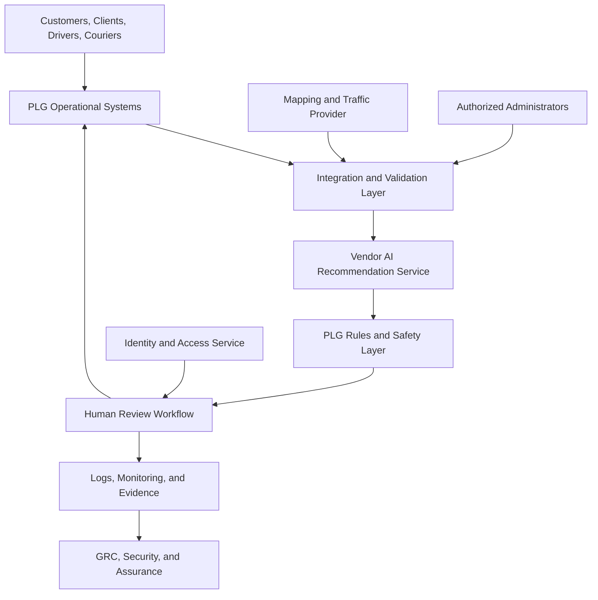
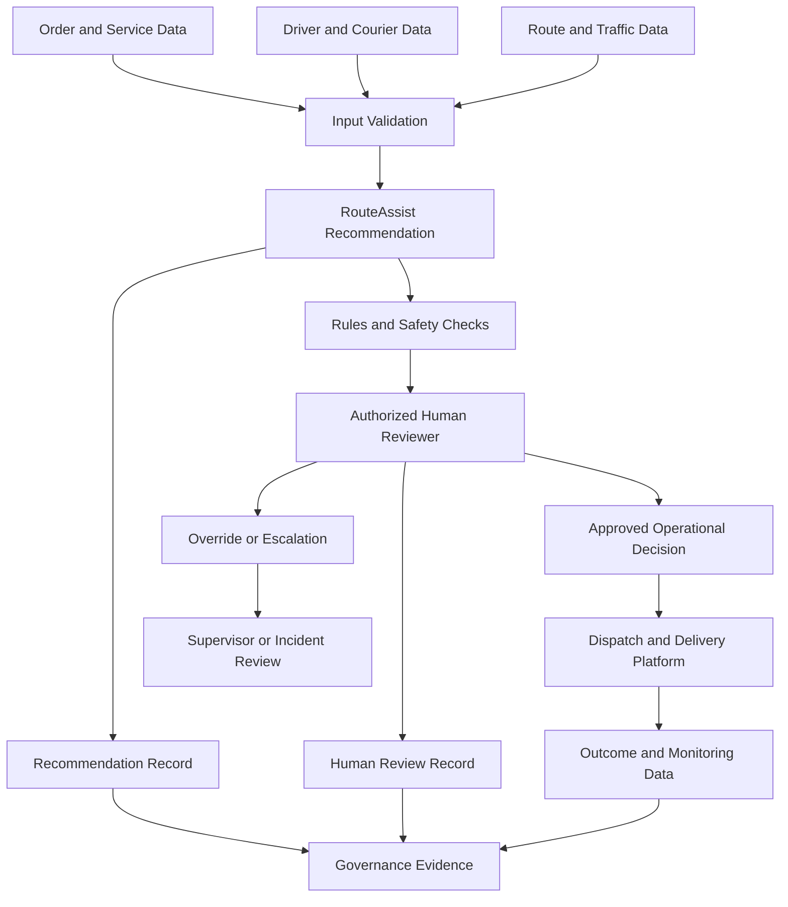
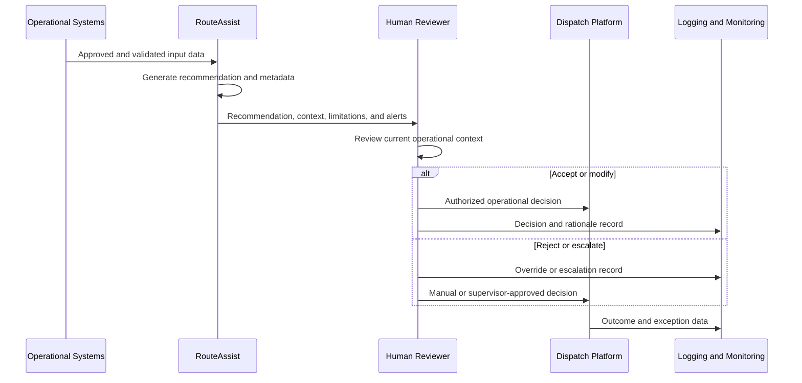

# Data Flow and System Context

## PLG RouteAssist

**Organization:** Peachtree Logistics Group (fictional)  
**AI system:** PLG RouteAssist  
**System identifier:** `AI-SYS-001`  
**Use-case identifier:** `UC-001`  
**Document owner:** CIO / IT Director  
**Governance owner:** GRC Analyst  
**Document status:** Draft portfolio artifact  
**Version:** 1.0  
**Review frequency:** At least annually and upon material architecture, data, vendor, or use-case change

---

## 1. Document Purpose

This document defines the system context, data flows, system components, external entities, trust zones, integrations, data stores, human decision points, and security and governance boundaries for PLG RouteAssist.

It provides the technical and operational foundation for the AI risk assessment, control matrix, evaluation plan, monitoring plan, vendor review, human-oversight design, and incident-response procedures.

The diagrams and flows are conceptual. They describe the fictional target environment and do not represent a production architecture.

---

## 2. Scope

### 2.1 In scope

- Data sources used by RouteAssist
- System inputs and outputs
- AI-processing and recommendation services
- User and administrator access paths
- Human review and override steps
- Internal and external integrations
- Operational and governance data stores
- Logging, monitoring, and evidence flows
- Third-party AI, mapping, traffic, and cloud dependencies
- Trust boundaries and security zones
- Downstream actions influenced by recommendations
- Manual fallback and incident-response paths

### 2.2 Out of scope

- Production-level network addressing
- Proprietary vendor architecture or source code
- Final API specifications
- Detailed firewall rules
- Actual encryption keys or secrets
- Live employee, courier, customer, patient, shipment, or delivery data
- Claims that the conceptual architecture is production-ready

---

## 3. System Boundary

The RouteAssist system boundary includes the components that collect approved PLG operational data, prepare input features, request or generate recommendations, display results to authorized reviewers, record human decisions, and create logs and monitoring data.

The boundary does not include every PLG system. A system is included when it:

- Supplies data to RouteAssist
- Receives a RouteAssist recommendation or approved human decision
- Controls RouteAssist access or configuration
- Stores RouteAssist records or evidence
- Supports monitoring, incident response, or governance
- Materially affects the accuracy, integrity, availability, or use of RouteAssist

---

## 4. External Entities

| Entity ID | External entity | Relationship to RouteAssist | Data exchanged |
| --- | --- | --- | --- |
| `EE-001` | Commercial customer | Submits delivery requests and receives service information | Order, destination, service level, delivery window, status, and exception communication |
| `EE-002` | Healthcare client | Submits medical-delivery requests and receives service information | Limited delivery details, approved priority indicator, destination, service commitment, and status |
| `EE-003` | PLG-employed driver | Receives approved assignment or route and submits status | Assignment, route, status, location, exception, and proof of delivery |
| `EE-004` | Independent courier | Receives approved assignment or route and submits status | Eligibility, availability, assignment, route, status, location, and proof of delivery |
| `EE-005` | Shipment recipient | Receives delivery and may provide confirmation or complaint | Delivery confirmation, exception, and complaint information |
| `EE-006` | AI service vendor | Provides or supports recommendation capability | Minimized approved inputs, recommendation output, metadata, and service events |
| `EE-007` | Mapping and traffic provider | Provides external route and traffic information | Origin, destination, route, distance, traffic, closure, and travel estimates |
| `EE-008` | Technology or cloud vendor | Hosts or supports system components | System, service, administrative, security, and availability data |
| `EE-009` | Contractual or oversight party | Receives authorized reports or notifications | Approved assurance, incident, service, or compliance information |

An external entity is outside PLG's direct operational control even when a contract governs the relationship.

---

## 5. Internal Actors

| Actor ID | Actor | System interaction |
| --- | --- | --- |
| `ACT-001` | Dispatcher | Reviews RouteAssist recommendations and accepts, modifies, rejects, overrides, or escalates them |
| `ACT-002` | Dispatch Supervisor | Reviews elevated cases, approves defined high-impact decisions, and directs escalation or restricted use |
| `ACT-003` | Operations Manager | Reviews operational effects, continuity, performance, and workflow issues |
| `ACT-004` | Data / AI Lead | Evaluates system behavior, data quality, performance, drift, and changes |
| `ACT-005` | IT Administrator | Maintains approved integrations, configurations, availability, and access |
| `ACT-006` | Information Security Analyst | Monitors security events and supports investigation and containment |
| `ACT-007` | GRC Analyst | Reviews risks, controls, evidence, exceptions, monitoring, and remediation |
| `ACT-008` | Internal Audit / Assurance | Independently reviews selected controls and evidence |
| `ACT-009` | Incident Manager | Coordinates incident triage, containment, recovery, and lessons learned |

---

## 6. System Components

| Component ID | Component | Function | Owner or provider |
| --- | --- | --- | --- |
| `CMP-001` | RouteAssist user interface | Presents inputs, recommendations, rationale, uncertainty, alerts, and review actions | PLG / AI vendor |
| `CMP-002` | RouteAssist orchestration service | Validates requests, assembles authorized inputs, invokes recommendation services, and returns results | PLG / AI vendor |
| `CMP-003` | AI recommendation service | Generates priority, assignment, route, schedule, exception, or escalation recommendations | AI vendor |
| `CMP-004` | Input validation and feature service | Validates format, completeness, timeliness, ranges, and approved fields | PLG / AI vendor |
| `CMP-005` | Business-rule and safety layer | Applies hard restrictions, use boundaries, eligibility rules, and escalation conditions | PLG |
| `CMP-006` | Human-review workflow | Records review, decision, override, rationale, escalation, and approval | PLG |
| `CMP-007` | Integration gateway | Manages approved interfaces with PLG and third-party systems | PLG |
| `CMP-008` | Identity and access service | Authenticates users and enforces role-based access | PLG |
| `CMP-009` | Logging and monitoring service | Collects security, operational, recommendation, review, and control events | PLG |
| `CMP-010` | Governance evidence repository | Stores approved risk, control, evaluation, exception, incident, and decision records | PLG |
| `CMP-011` | Reporting and dashboard service | Produces approved performance, risk, control, and executive reports | PLG |
| `CMP-012` | Manual dispatch process | Provides fallback when RouteAssist is unavailable, restricted, or rejected | PLG |

---

## 7. Source and Downstream Systems

| System ID | System | Relationship | Relevant information |
| --- | --- | --- | --- |
| `SYS-001` | Logistics and freight platform | Upstream source | Customer order, shipment, service type, destination, delivery window, and status |
| `SYS-002` | Warehouse Management System | Upstream source | Shipment readiness, inventory status, staging, and fulfillment context |
| `SYS-003` | Dispatch and delivery platform | Upstream and downstream | Driver availability, assignments, routes, status, exceptions, and final approved decisions |
| `SYS-004` | Mapping and traffic service | External upstream source | Route, distance, travel time, traffic, closures, and road conditions |
| `SYS-005` | Identity and access platform | Control dependency | User identity, authentication, role, and access status |
| `SYS-006` | Incident and exception system | Upstream and downstream | Prior incidents, exception categories, complaints, investigations, and corrective actions |
| `SYS-007` | Microsoft 365 | Governance and communication support | Approved documentation, meeting records, notifications, and evidence |
| `SYS-008` | Security monitoring platform | Monitoring destination | Authentication, access, API, administrative, and security events |
| `SYS-009` | Billing and accounting system | Indirect downstream system | Approved delivery and service records used for billing; AI output must not write directly without human-approved workflow |

---

## 8. Data Stores

| Store ID | Data store | Contents | Primary owner | Key concern |
| --- | --- | --- | --- | --- |
| `DS-001` | Operational source records | Orders, shipments, delivery windows, service levels, and status | Dispatch Director | Accuracy, completeness, access, and timeliness |
| `DS-002` | Workforce and courier records | Identity, availability, eligibility, workload, and vehicle information | Operations / HR | Personal data, purpose limitation, and secondary use |
| `DS-003` | Route and traffic cache | Approved mapping, travel, closure, and traffic data | CIO / IT Director | Staleness, provider accuracy, and licensing |
| `DS-004` | Recommendation store | Inputs reference, recommendation, model or service version, rationale, uncertainty, and timestamp | Data / AI Lead | Integrity, reproducibility, and sensitive data exposure |
| `DS-005` | Human-review record store | Reviewer, decision, override, rationale, escalation, approval, and timestamp | Dispatch Director | Completeness, retaliation risk, integrity, and access |
| `DS-006` | Evaluation repository | Datasets, scenarios, test configuration, results, approvals, and limitations | Data / AI Lead | Dataset governance, reproducibility, and result integrity |
| `DS-007` | Security and operational logs | Access, administrative, integration, error, security, and system-health events | Information Security Lead | Tampering, excessive data, retention, and alert coverage |
| `DS-008` | Governance evidence repository | Policies, risks, controls, tests, exceptions, incidents, and approvals | GRC Analyst | Version control, evidence integrity, and unauthorized changes |
| `DS-009` | Complaint and incident records | Complaints, disputes, incidents, investigations, notifications, and corrective actions | Customer Service / Incident Manager | Sensitive content, access, timeliness, and traceability |

---

## 9. Trust Zones

| Zone ID | Trust zone | Description | Examples |
| --- | --- | --- | --- |
| `TZ-01` | External requester zone | People and organizations submitting or receiving delivery-related information | Customers, healthcare clients, recipients |
| `TZ-02` | PLG user zone | Authorized workforce devices and user sessions | Dispatcher workstation, supervisor workstation, approved mobile device |
| `TZ-03` | PLG application zone | PLG-managed operational applications and integration services | Dispatch platform, WMS, integration gateway, RouteAssist interface |
| `TZ-04` | AI vendor zone | Vendor-hosted AI-processing components outside PLG's direct control | AI recommendation API and vendor support services |
| `TZ-05` | External data-provider zone | Third-party operational data services | Mapping, traffic, weather, or road-closure provider |
| `TZ-06` | PLG data zone | PLG-controlled operational, review, evidence, and log stores | Recommendation, review, evaluation, governance, and logging repositories |
| `TZ-07` | Privileged administration zone | Restricted technical and security administration paths | Administrator console, secrets management, monitoring administration |
| `TZ-08` | Governance and assurance zone | Controlled access to governance evidence and independent-review records | GRC repository, committee records, audit workpapers |

Crossing a trust boundary requires documented authentication, authorization, encryption, validation, logging, and vendor or interface governance appropriate to the risk.

---

## 10. System Context Diagram

### 10.1 Diagram interpretation

- Operational systems supply approved business data.
- The integration and validation layer minimizes and validates inputs.
- The vendor AI service generates an advisory recommendation.
- PLG-controlled rules apply use boundaries and escalation conditions.
- An authorized person reviews the output before consequential downstream action.
- Decisions, overrides, errors, and administrative events are logged.
- Governance, security, and assurance roles review the resulting evidence.

---

## 11. High-Level Data Flow

RouteAssist output cannot move directly to a consequential operational action without the approved human-review workflow.

---

## 12. Detailed Data-Flow Register

| Flow ID | Source | Destination | Information | Purpose | Trust boundary | Required safeguards |
| --- | --- | --- | --- | --- | --- | --- |
| `DF-001` | Commercial or healthcare client | Logistics platform | Order, destination, delivery window, service level, and approved priority indicator | Create delivery request | `TZ-01` to `TZ-03` | Secure channel, input validation, authentication where applicable, and data minimization |
| `DF-002` | Logistics platform | Integration gateway | Approved order and shipment fields | Prepare RouteAssist request | Within `TZ-03` | Service authentication, field allowlist, encryption, logging, and error handling |
| `DF-003` | WMS | Integration gateway | Shipment readiness and fulfillment status | Confirm operational readiness | Within `TZ-03` | Authentication, timeliness check, integrity validation, and logging |
| `DF-004` | Dispatch platform | Integration gateway | Driver or courier eligibility, availability, workload, vehicle, and location | Support assignment recommendation | Within `TZ-03`; personal data | Field minimization, access control, freshness checks, and secondary-use restriction |
| `DF-005` | Mapping and traffic provider | Integration gateway | Route, distance, travel time, traffic, closure, and road information | Support routing and scheduling | `TZ-05` to `TZ-03` | Vendor authentication, encryption, freshness checks, error handling, and provider monitoring |
| `DF-006` | Integration gateway | Input validation service | Assembled approved request | Validate required fields and permitted ranges | Within `TZ-03` | Schema validation, data-quality rules, missing-data handling, and logging |
| `DF-007` | Input validation service | AI recommendation service | Minimized approved features | Generate recommendation | `TZ-03` to `TZ-04` | Encryption, API authentication, minimization, contract restrictions, and request logging |
| `DF-008` | AI recommendation service | Rules and safety layer | Recommendation, rationale or factors, uncertainty, model/service version, and timestamp | Apply PLG constraints and prepare review | `TZ-04` to `TZ-03` | Response validation, integrity check, version capture, timeout handling, and logging |
| `DF-009` | Rules and safety layer | Human-review workflow | Recommendation plus warnings, constraints, and escalation status | Support authorized human decision | Within `TZ-03` | Role-based access, clear labels, relevant context, and no hidden auto-approval |
| `DF-010` | Identity platform | Human-review workflow | User identity, role, session, and authorization | Authenticate and authorize reviewer | `TZ-02` to `TZ-03` | Multifactor authentication, least privilege, session protection, and logging |
| `DF-011` | Human reviewer | Human-review record store | Decision, override, rationale, escalation, user, and timestamp | Preserve accountability and evidence | `TZ-02` to `TZ-06` | Required fields, integrity, access control, retention, and audit trail |
| `DF-012` | Human-review workflow | Dispatch platform | Approved assignment, route, priority, timing, or exception decision | Execute human-approved operational decision | Within `TZ-03` | Human-approval indicator, authorization, integrity, logging, and duplicate prevention |
| `DF-013` | Dispatch platform | Driver or courier device | Approved assignment, route, and instructions | Perform delivery | `TZ-03` to `TZ-02` or external mobile context | Device authentication, encryption, limited display, and update handling |
| `DF-014` | Driver or courier | Dispatch platform | Status, location, exception, and delivery confirmation | Track delivery and outcome | `TZ-02` to `TZ-03` | Authentication, validation, minimization, and offline/error handling |
| `DF-015` | Recommendation and review stores | Monitoring service | Recommendation, decision, override, response time, error, and outcome events | Monitor performance, human behavior, and control operation | `TZ-06` to monitoring components | Pseudonymization where feasible, access control, integrity, and approved metrics |
| `DF-016` | Systems and integrations | Security monitoring platform | Authentication, administrative, API, error, and security events | Detect unauthorized or abnormal activity | `TZ-03`, `TZ-04`, and `TZ-07` to security monitoring | Centralized logging, time synchronization, tamper protection, and alerts |
| `DF-017` | Monitoring service | Governance dashboard | Aggregated performance, risk, override, complaint, incident, and control metrics | Governance and executive review | `TZ-06` to `TZ-08` | Aggregation, access restriction, metric definitions, and versioned reports |
| `DF-018` | Complaint or incident channel | Incident system | Complaint, dispute, suspected error, misuse, or harm | Triage and investigation | Multiple zones to `TZ-06` | Secure intake, routing, confidentiality, timestamps, and case linkage |
| `DF-019` | Incident system | Governance evidence repository | Investigation, decision, corrective action, and closure evidence | Oversight and lessons learned | Within `TZ-06` and `TZ-08` | Case access, evidence integrity, approvals, and retention |
| `DF-020` | Vendor | PLG owners and incident team | Change notice, outage, performance issue, vulnerability, or incident notice | Trigger assessment, containment, or revalidation | `TZ-04` to PLG governance zones | Contractual timeline, authenticated channel, escalation, and record retention |

---

## 13. Recommendation and Human-Decision Sequence

The reviewer is not a ceremonial approval step. The reviewer must have sufficient context, authority, competence, and time to disagree with RouteAssist.

---

## 14. Human Decision Points

| Decision point | Input | Authorized role | Required record | Escalation trigger |
| --- | --- | --- | --- | --- |
| Routine assignment | Recommendation, eligibility, availability, workload, and delivery needs | Dispatcher | Final assignment and override status | Missing data, conflict, repeated pattern, or elevated delivery |
| Route selection | Proposed route, current conditions, safety, vehicle, and timing | Dispatcher or driver within authority | Accepted or modified route when required | Unsafe condition, closure, high uncertainty, or critical timing |
| Delivery priority | Service level, approved indicator, timing, and operational context | Dispatcher | Final priority decision | Medical delivery, severe service effect, or unsupported priority |
| Schedule adjustment | Affected deliveries, timing, customer commitments, and capacity | Dispatcher or supervisor | Adjustment decision and rationale | Material downstream effect or high-impact delivery |
| Exception classification | Suggested category and event evidence | Authorized operations employee | Validated category | Ambiguity, customer dispute, safety, privacy, or severe incident |
| System restriction | Monitoring, incident, or control evidence | Authorized operational, technical, security, or incident role | Restriction or suspension decision | Stop condition, severe incident, threshold breach, or unauthorized use |
| Return to service | Remediation, testing, residual risk, and approval evidence | Authorized governance authority | Return-to-service decision | Unresolved gap, failed validation, or unacceptable residual risk |

---

## 15. Data Quality Requirements

Data supplied to RouteAssist should be evaluated for:

- Completeness
- Accuracy
- Timeliness and freshness
- Validity and permitted range
- Consistency across sources
- Uniqueness and duplicate handling
- Representativeness of relevant conditions
- Lineage and source traceability
- Appropriate labeling
- Missing-value treatment
- Outlier handling
- Purpose compatibility
- Known limitations

### 15.1 Data-quality failure handling

| Condition | Required response |
| --- | --- |
| Required field missing | Do not generate a normal recommendation; request correction or escalate |
| Stale traffic or availability data | Warn reviewer, refresh data, or use manual process |
| Conflicting source records | Present conflict and require human resolution |
| Invalid or out-of-range value | Reject input and log validation failure |
| Unrecognized service type or geography | Do not extrapolate silently; escalate or restrict use |
| Medical-delivery indicator uncertain | Treat as elevated and require authorized verification |
| Repeated source-quality failure | Open issue, assess affected outputs, and consider suspending related capability |

---

## 16. Data Minimization and Purpose Limitation

RouteAssist should receive only fields required for an approved capability.

The system must not use data to:

- Infer protected or highly sensitive traits unnecessary for delivery operations
- Conduct covert employee surveillance
- Create unauthorized worker-performance scores
- Make employment or disciplinary decisions
- Expand into marketing, profiling, or unrelated analytics without review
- Train or improve a vendor model unless contractually authorized and approved by PLG
- Retain raw personal or sensitive information longer than necessary

Free-text inputs should be avoided or restricted because they may introduce unnecessary personal, medical, customer, or confidential information.

---

## 17. Preliminary Retention Schedule

Final retention periods require legal, contractual, privacy, operational, and records-management review.

| Record category | Preliminary retention approach | Rationale |
| --- | --- | --- |
| Recommendation record | Retain for defined evaluation, investigation, audit, and operational period | Supports reproducibility and accountability |
| Human-review and override record | Retain with related recommendation and operational decision | Demonstrates meaningful oversight and rationale |
| Evaluation datasets and results | Retain through relevant system version and assurance period | Supports validation, regression review, and decision evidence |
| Security and administrative logs | Retain according to security-monitoring and investigation needs | Supports detection and incident investigation |
| Governance decisions and risk acceptance | Retain as controlled governance records | Supports accountability and historical traceability |
| Incident and complaint records | Retain according to incident, legal, contractual, and records requirements | Supports investigation, notification, and improvement |
| Temporary integration data | Delete or expire promptly after authorized processing unless retention is justified | Reduces unnecessary exposure |

Retention must not be extended solely because storage is inexpensive.

---

## 18. Access Model

| Access role | Permitted access | Prohibited access |
| --- | --- | --- |
| Dispatcher | View authorized recommendations and create review records | Change model, thresholds, permissions, or governance evidence |
| Dispatch supervisor | Review elevated cases, overrides, and relevant operational trends | Modify vendor model or security logs |
| Data / AI Lead | Access approved evaluation, performance, and model-management functions | Approve own production readiness without independent review |
| IT administrator | Maintain infrastructure, integrations, configuration, and availability | Use operational data for unrelated purposes |
| Security administrator | Review security events and perform authorized containment | Modify business decisions or evaluation outcomes |
| GRC Analyst | Review risks, controls, evidence, exceptions, and reports | Operate technical controls solely to later assess them independently |
| Internal Audit / Assurance | Read selected evidence and test controls | Administer or own the control under review |
| Vendor support | Time-limited, approved, monitored support access | Persistent unrestricted access or unauthorized data extraction |

Privileged access should require named accounts, approval, multifactor authentication, logging, periodic review, and prompt removal.

---

## 19. Logging and Evidence Requirements

RouteAssist should record:

- Request identifier
- System and service version
- Approved input references or necessary values
- Data-quality warnings
- Recommendation and output type
- Rationale, factors, or explanation presented
- Uncertainty or confidence information when available and appropriate
- Applied business rules or blocks
- User identity and role
- Review decision
- Override or modification
- Required rationale
- Escalation and approval
- Timestamp and system time source
- Downstream action status
- Error, timeout, or fallback event
- Related complaint, incident, change, or evaluation identifier

Logs must be protected from unauthorized alteration and must not expose unnecessary sensitive data.

---

## 20. Security and Privacy Boundaries

### 20.1 Boundary controls

Each trust-boundary crossing should consider:

- Mutual or service authentication
- Authorization and least privilege
- Encryption in transit
- Approved encryption at rest
- Schema and content validation
- Rate and volume limits
- Replay and duplicate protection
- Timeout and failure handling
- Secrets management
- Administrative separation
- Security logging and alerting
- Vendor contractual controls
- Data minimization
- Retention and deletion

### 20.2 High-concern boundaries

| Boundary | Concern |
| --- | --- |
| PLG to AI vendor | Personal or sensitive data exposure, vendor reuse, model change, subcontractors, response integrity, and availability |
| Mapping provider to PLG | Stale, inaccurate, manipulated, or unavailable route information |
| User device to PLG applications | Credential compromise, insecure device, session theft, or outdated information |
| Administrator to privileged functions | Unauthorized configuration, threshold, integration, or logging changes |
| RouteAssist to dispatch platform | AI recommendation becoming an action without genuine human approval |
| Monitoring to governance reporting | Incorrect aggregation, missing context, or unauthorized access to sensitive metrics |

---

## 21. Failure and Fallback Paths

| Failure scenario | Expected system response | Human fallback |
| --- | --- | --- |
| AI vendor unavailable | Do not create fabricated or stale normal recommendation; log outage | Use manual dispatch process |
| Mapping provider unavailable | Display limitation and prevent unsupported route confidence | Use approved alternate tools or manual planning |
| Required input missing | Block normal recommendation or clearly flag incomplete input | Correct data or use manual decision |
| Conflicting input data | Present conflict and prevent silent resolution | Authorized reviewer resolves using source systems |
| Recommendation service timeout | Log timeout and avoid duplicate action | Manual dispatch or approved retry |
| Human-review workflow unavailable | Do not allow direct AI-to-operation action | Use controlled manual approval record |
| Security incident | Restrict interfaces or suspend RouteAssist as required | Continue essential operations through approved manual process |
| Monitoring or logging failure | Alert owners and consider restricting high-impact use | Use manual evidence process until restored |
| Model or version mismatch | Block or flag request and initiate change review | Use last approved manual process; do not silently downgrade |

Fallback procedures must be tested. A documented manual process is not sufficient if PLG lacks the staffing, information, access, or time to execute it.

---

## 22. Data-Flow Risk Observations

| Observation ID | Observation | Potential risk theme | Later treatment |
| --- | --- | --- | --- |
| `OBS-001` | RouteAssist depends on multiple upstream systems with different update frequencies | Data quality and reliability | Risk register and input-validation controls |
| `OBS-002` | Workforce location, workload, and eligibility data may influence assignments | Privacy, workforce effect, and fairness | Risk register, workforce review, minimization, and slice analysis |
| `OBS-003` | Medical-delivery indicators can affect priority and timing | Safety and critical-service impact | Tier 4 controls, restricted scope, and heightened evaluation |
| `OBS-004` | Vendor AI processing crosses PLG's direct-control boundary | Vendor, privacy, security, and transparency | Due diligence, contract controls, monitoring, and exit plan |
| `OBS-005` | Human approval may become nominal under time pressure | Automation bias and ineffective oversight | Interface testing, training, override monitoring, and supervisor review |
| `OBS-006` | Downstream dispatch systems can operationalize a recommendation quickly | Unauthorized automation and error propagation | Human-approval token, authorization, validation, and audit trail |
| `OBS-007` | Historical outcomes may include earlier RouteAssist-influenced decisions | Feedback loop and bias reinforcement | Dataset lineage, outcome separation, and periodic review |
| `OBS-008` | Logs and rationale records may contain sensitive operational or personal data | Privacy and evidence exposure | Field minimization, access control, retention, and monitoring |
| `OBS-009` | External route data may be stale or inaccurate | Safety and operational failure | Freshness checks, alternate sources, warnings, and fallback |
| `OBS-010` | Vendor or model changes may invalidate prior evaluation | Change and revalidation risk | Version capture, notification, regression testing, and approval |

These observations are not final risk ratings. They are inputs to the formal AI risk register.

---

## 23. Architecture Assumptions and Information Gaps

| Gap ID | Assumption or missing detail | Owner | Required action |
| --- | --- | --- | --- |
| `ARCH-001` | Final AI vendor and hosting model are not selected | CIO / IT Director | Document architecture and data locations before vendor approval |
| `ARCH-002` | Exact API fields and schemas are not finalized | Data / AI Lead | Create approved field-level interface specification |
| `ARCH-003` | Data residency and subcontractor processing are unknown | Procurement / Vendor Manager | Obtain contractual and technical evidence |
| `ARCH-004` | Recommendation rationale and uncertainty presentation are not finalized | Data / AI Lead | Define and evaluate human-interface requirements |
| `ARCH-005` | Final retention periods are not approved | Legal / Privacy Advisor | Complete records and privacy review |
| `ARCH-006` | Manual fallback capacity is not tested | Operations Manager | Conduct continuity exercise |
| `ARCH-007` | Logging coverage and tamper protection are not validated | Information Security Lead | Complete logging design and control test |
| `ARCH-008` | Downstream systems may permit automated actions | CIO / IT Director | Verify that human approval is technically enforced |
| `ARCH-009` | Model or service versioning behavior is not confirmed | Data / AI Lead | Require version capture and change notification |
| `ARCH-010` | Sensitive medical-delivery fields require further minimization review | Legal / Privacy Advisor and Dispatch Director | Define the minimum required indicators and access |

Unknowns must be treated as unresolved, not assumed safe.

---

## 24. Validation Checklist

Before this architecture supports a pilot decision, PLG should confirm:

- [ ] Every component and integration has an accountable owner.
- [ ] Approved data fields and purposes are documented.
- [ ] Data lineage is traceable from source to recommendation and decision.
- [ ] Trust-boundary safeguards are designed and tested.
- [ ] Vendor data use, storage, subprocessors, changes, and incidents are governed.
- [ ] Human approval is technically required before consequential downstream action.
- [ ] Recommendation and review records are linked.
- [ ] System and model versions are captured.
- [ ] Logging supports investigation and control testing.
- [ ] Sensitive data is minimized in requests, responses, and logs.
- [ ] Retention and deletion requirements are approved.
- [ ] Manual fallback is documented and exercised.
- [ ] High-impact and medical-delivery flows are restricted until separately approved.
- [ ] Security, privacy, operational, vendor, and governance reviews are complete.
- [ ] Material changes trigger architecture review and revalidation.

---

## 25. NIST AI RMF Alignment

| NIST AI RMF function | Application in this document |
| --- | --- |
| GOVERN | Assigns component, data, access, vendor, evidence, and architecture ownership |
| MAP | Defines system context, users, affected parties, data, components, flows, dependencies, and trust boundaries |
| MEASURE | Identifies logging, data quality, evaluation evidence, monitoring, and validation requirements |
| MANAGE | Defines safeguards, fallback, escalation, material-change triggers, and unresolved architecture actions |

Detailed subcategory mappings will be maintained in [`07-framework-crosswalk.md`](07-framework-crosswalk.md).

---

## 26. Review Triggers

This document must be reviewed when:

- A data source, field, purpose, store, or retention period changes.
- A system component, integration, interface, or trust boundary changes.
- The AI model, service, vendor, subprocessor, or hosting location changes.
- RouteAssist begins sending output to a new downstream system.
- Human approval or override behavior changes.
- A new user, affected party, capability, geography, or service type is introduced.
- Medical-delivery or other high-impact use changes.
- A security, privacy, operational, or data-quality incident reveals an undocumented flow.
- Monitoring identifies missing logs, unexplained output, or data lineage failure.
- RouteAssist is suspended, restored, or retired.

---

## 27. Document Control

| Field | Value |
| --- | --- |
| Document title | Data Flow and System Context |
| Repository path | `docs/04-data-flow-and-system-context.md` |
| Version | 1.0 |
| Status | Draft portfolio artifact |
| Owner | CIO / IT Director |
| Governance owner | GRC Analyst |
| Approver | AI Governance Committee |
| Review frequency | At least annually and upon material architecture, data, vendor, or use-case change |
| Classification | Public fictional portfolio content |

### Version history

| Version | Date | Author | Change summary |
| --- | --- | --- | --- |
| 1.0 | 2026-09-19 | Tommy Marshall | Established the conceptual system context, trust zones, data stores, detailed flow register, human decision points, fallback paths, and architecture validation requirements. |

---

## 28. Related Documents

- [Project README](../README.md)
- [Project Overview and Methodology](00-project-overview-and-methodology.md)
- [Organization Profile and AI Use Case](01-organization-profile-and-ai-use-case.md)
- [Stakeholder and Accountability Map](02-stakeholder-and-accountability-map.md)
- [AI System Inventory and Impact Screening](03-ai-system-inventory-and-impact-screening.md)
- [AI Risk Assessment Methodology](05-ai-risk-assessment-methodology.md)
- [AI Risk Register](06-ai-risk-register.md)
- [AI Control Matrix](09-ai-control-matrix.md)
- [Human Oversight and Escalation Plan](10-human-oversight-and-escalation-plan.md)
- [AI Evaluation and Testing Plan](11-ai-evaluation-and-testing-plan.md)
- [Monitoring, Metrics, and Reporting Plan](12-monitoring-metrics-and-reporting-plan.md)
- [AI Incident Response Plan](13-ai-incident-response-plan.md)

---

## 29. Portfolio Notice

This document is part of an educational portfolio project based on a fictional organization and fictional AI system. The systems, data flows, components, trust zones, controls, and architecture assumptions are illustrative.

It is not a production architecture, security certification, privacy determination, independent assurance conclusion, or guarantee that a real AI system is safe, secure, compliant, reliable, or suitable for deployment.
